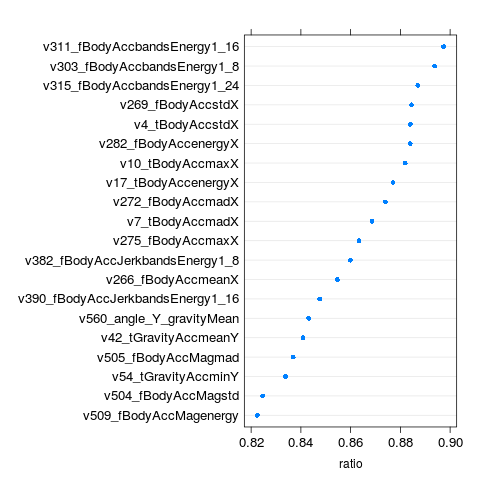
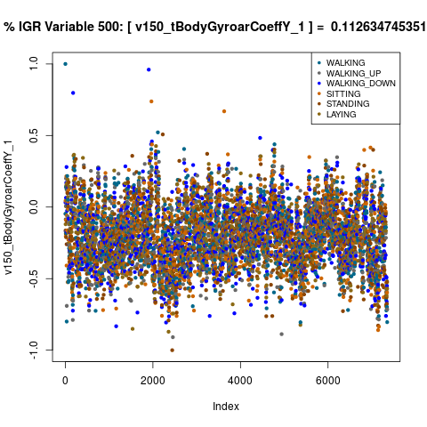
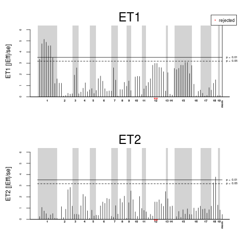

<!--
%% \VignetteEngine{knitr::rmarkdown}
-->
`r library("knitr")`
`r opts_chunk$set(cache=FALSE, fig.width=6, fig.height=4, message=FALSE, warning=FALSE,include=TRUE,fig.cap="Caption")`

**Author: Ouskova-Leonteva Anna (<a
  href="mailto: leopard152015@gmail.com">leopard152015@gmail.com</a>)<br />
Date: May 22, 2016<br />**


*The aim of the current work is to study the complex etiology of obesity and identify genetic
variations and/or factors related to nutrition and physical exercise that contribute to its variability. 
By identifying specific compositions of factors, we hope to distinguish and predict cases of genetic and non genetic obesity.*

# Introduction

Obesity (body mass index > 25 kg/m2) is considered a global public health problem and occurs when energy intake from food and drink consumption is greater than energy expenditure through the body’s metabolism and physical activity over a prolonged period, resulting in the accumulation of excess body fat. Obesity is a serious concern because it is associated with heart disease, stroke, type 2 diabetes and certain types of cancer, some of the leading causes of preventable death. 

According to the World Health Organization (2013), worldwide over 600 million adults and 42 million children are obese, figures which have more than doubled since 1980. In France, 6.5 million people are considered to obese (14.5% of the adult population) [[1]](www.obesite-sante.com).

The causes of the obesity epidemic over the past 30 years are known to be multi factorial (including genetic makeup, neuroendocrine disorders, emotions, and even secondary effects from medical treatments) [2]. Until recently, the rise in obesity was generally believed to result from a caloric imbalance, linked to the easy availability of energy-dense foods and the convenience of labor-saving, or more accurately ‘human-energy-saving’, devices for every day activities and transport. However, the current paradigm that overeating of easily digestible carbohydrates and the resulting energy imbalance is the cause of obesity has recently been challenged [3]. Indeed, recent studies show that obesity is a highly complex disease with both causal and contributory links to metabolic dysfunction. Development of obesity is influenced by multiple pathways, including (i) eating behaviors directly regulated by the brain, (ii) energy expenditure in tissues such as liver, fat and muscle; (iii) and changes in adiposity mediated by adipocyte differentiation and lipid accumulation in adipose tissues [4].

The neuropathology of obesity has been studied by examining genetic and acquired brain diseases that cause or are influenced by obesity [5]. For example, Bardet-Biedl syndrome (BBS) is an example of a monogenic cause of obesity, linked to the abnormal detection of peripheral signals in the brain that regulate energy homeostasis. BBS is a rare, generally autosomal-recessive disorder: it is clinically heterogeneous but is associated with six core features: obesity, retinal dystrophy, renal abnormalities, polydactyly, learning disability and urogenital tract deficits. Obesity affects 72–92% of BBS patients. The study of the origins of obesity in BBS helped make the link between inactivation of ciliary genes and disorders of the hypothalamic regulation of food intake. However, even in the context of a monogenic obesity such as BBS, it is clear that obesity is the result of imbalances in numerous signaling cascades combined with defects in regulation of cellular differentiation pathways [6].

The project is a collaboration between the clinicians and molecular biologists studying BBS in the Laboratoire de Génétique Humaine, Strasbourg and the Complex Systems and Translational Bioinformatics team, Icube, Strasbourg.

# Related works
“When comparing BBS patients to control subjects with a similar BMI, BBS patients exhibit higher fat mass and increased visceral fat. The preferential deposition of fat intraabdominally in patients with BBS may indicate a predisposition for metabolic complications, including hypertension and hypertriglyceridemia. The observation of disparate results in the BBS10 vs. BBS1 mutation groups is the first demonstration of physiological differences among patients with BBS caused by mutations in distinct genes. These results suggest that the obesity of BBS is distinct from nonsyndromic obesity” [7]. **(to be continued)**

# Method description
Environmental factors, such as diet, physical activity, age, gender, socio-economic status and ethnicity, among others, have been shown to modulate the risk for obesity [13]. As obesity genetics makes further progress, considerable interest has recently been turned to the potential interactions between obesity-predisposing gene variants and specific environmental situations.
“Genetic testing is taking medical nutrition therapy to a new level where we can individualize lifestyle interventions to optimize outcomes based on a better understanding of what works and what does not, advancing precision medicine in this field,” said Dr. Osama Hamdy, PhD Medical Director of the Obesity Clinical Program at Joslin Diabetes Center and Assistant Professor of Medicine at Harvard Medical School.  The approach is a personalized nutrigenomic profile that provides individualized information to physicians and their patients in order to help them understand how genetics and lifestyle may impact their diet, nutrition, and exercise.  The definition of personalized medicine for obesity  is the use of information about the genetic makeup of a person with obesity to tailor strategies for preventing, detecting, treating, or monitoring their obesity. In the article [18] was proposed strategie of personalized medicine for diabetes, where the identification of risk factors through genotype  is accompanied by an effective therapy. According [18], the practice of personalized medicinegenerally  involves four processes:

 -  The identification of genes and biomarkers for patients;
 -  After these predictors of disease are identified, is allocation of resources to prevent or detect the disease phenotype in high-risk individuals, whose risk is based on their 	genotype;
 -  The selection of individualized therapies for affected individuals with  deciding which diet 	    to prescribe and/or which drug to prescribe;
 -  The measurement of circulating biomarkers of disease to monitor the response to prevention or therapy.
 
In this work we cover relevant parameters to obesity classification with personalized approach in case of BBS and determine the role of machine learning in this context. 

The vast amount of parameters for personalization makes obesity management increasingly complex.  Today the availability of smart health technology like continuous glucose monitoring, physical activity detection, location and movement data, image recognition for planned meals [19], speech-recognition diet tracking [20] offer large data sets which can be used for types classification, initialization and improvement of the therapy of an individual obese person . The large amount of generated data shows the importance of knowledge discovery in data handling/processing for therapy personalization. Better understanding the correlation between phenotypes and genotypes will help  to  improve the accuracy of classification as well as treatment process.
In fact, bioinformatics research entails many problems that can be solved by data mining tasks. Concretely, physical
activity recognition as well as heart rate  using wearable sensors can provide valuable information regarding individual’s movements and help us to determine some aspects of her health.
The main contributions in this work are 4-fold:

 -  First, after defining main features of patiant's health status (age, weight, height, BMI, etc) in context BBS, we propose the use of  Wireless Body Area Network  (WBAN) technology to gather this information for predicting the individual's activity. Note that, in this phase, in order to personalize the system, each user configures health trackers application with own feature's values.
  - Second,  the physical activity will be determined using machine learning techniques over data collected from  wearable sensors ( health trackers and a smartphone) for  estimating with accuracy activity-related energy expenditure (AEE). Here under AEE we consider differance between total energy expenditure (TEE) and resting energy expenditure (REE). 
  - Theard, we will construct a classifying model from previous data, which helps us to represent a health care context (including biometric data, possible diseases, fitness status, intensity of the activity)  in order to understand connection between genotypes and phenotypes.
  - Forth, we will use combined analysis of pleiotropy and epistasis to  examine interactions for the previously determined phenotypes, which revealed an extensive directed network of genetic loci interacting with each other. We found these interactions to be useful in generating hypotheses for functional relationships between genetic loci. Epistasis is often difficult to interpret in terms of biological consequences or overall genetic architecture. Here we investigate the prevalence and consequences of epistasis by analyzing features which have been got on the first step. Taking into account dimension of genetic information we suppose to implement deep learning algorithms for decision of this task.  

As result we hope to determine in case BBS:

 -  Role in energy regulation;
 -  Gene-phenotype;
 -  Role/mechanisms in common obesity

All analyses were made using the differenet packages  from the R software[[14]](www.cran.r-project.org).

We use R because:

 -  It is a free software environment for statistical computing and graphics; 
 -  Runs on a wide variety of UNIX platforms, Windows and MacOS (interactive or batch mode);  
 -  Free and open source, can be downloaded from [https://cran.r-project.org](https://cran.r-project.org);
 -  Wide range of packages (base & contributed), novel methods available;
 -  Concise grammar & good structure (function, data object, methods and class);
 -  Help from manuals and email group; 
 -  Can be overcome by parallel computation, and/or integration with C;
 -  Popular, used by 70~80% statisticians.
 
 
  
# Patient cohorts and data

*Our goal is to create a research cohort consisting of obese patients with and without genetic factors, who will share genetic data, biological samples, diet/lifestyle information, and in particular sensor/mobile data (see section 4.2).*

## Wireless Body Area Network
As one of the tasks, there is a need for tools such as sensor/mobile data that allow people to measure their physical activity intensity and intake over the course of a day to make informed decisions, and perform energetic trade-offs. 
Daily information about conditions of health, physical activity level, energy expenditure, and energy intake is central to weight control since energy balance is defined by the interaction between these variables.
Wireless Body Area Network (WBAN) is a special kind of autonomous sensor network evolved to provide a wide variety of services. WBAN has emerged as a technology for e-healthcare that allows data concerning a patient’s vital body parameters and movements to be collected by small wearable or implantable sensors and communicated using short-range wireless communication techniques and has shown great potential in improving healthcare quality.  Today, WBAN has become an integral component of health care management system where a patient needs to be monitored both inside and outside of home or hospital. 
Unfortunately, existing technologies in the area of physical activity are mostly designed for individuals who have already achieved a high level of physical fitness and are in good health. Most of them are equipped with heart rate sensor and accelerometer and provides means to track the heart rate, hours of sleep, speed, distance, pace and calories burned. But this is not enough for a medical application. The accurate measurement of physical activity, energy expenditure, and energy intake is challenging and, at present, there is no technology that allows people to measure these variables comfortably, accurately, and continuously over the course of a day and obtain real-time feedback. 
One of the challenges for this project will be to define technologies (system of multi devices and set of algorithms) that can measure and analyze many physical parameters (such as galvanic skin response. blood oxygen saturation, calorie intake, blood pressure, blood glucose) and that are adapted for use by patients who have difficulty maintaining a healthy weight and minimum levels of physical activity every day.
As we will be collecting human patient-related data, safety issues need to be taken into account to avoid any risk to life, as well as security and privacy protection issues for the data collected from a WBAN, either while stored inside the WBAN or during their transmission outside of the WBAN. Controlling congestion and security is a major unsolved concern, with challenges resulting from stringent resource constraints of WBAN devices, and the high demand for both security/privacy and practicality/usability. In this work, we will address two important data security issues: secure and dependable distributed data storage, and fine-grained distributed data access control for sensitive and private patient medical data, as well as considering the diverse practical issues that need to be taken into account while fulfilling the security and privacy requirements. 

### Energy expenditure estimation

As energy expenditure (EE) estimation present the key aspect in obesity determination,
this section we dedicate to EE model combining accelerometer, physiological data from wearable sensors and EE using Bayesian models and hierarchical regression. 
EE (Calories burnt) make up half of the energy balance equation: 
**(to be continued)**


### Health trackers selection
The objective classification of HT is a important condition for the understanding of the complex relationship between health and physical activity. Many different Health Trackers (HTs) were considered  during this study. Generally we can divide them by commercially availability, manufacturer ( big brands / start-ups or future projects) and area of applying ( medical / fitness).
Further details about these sensors are provided in Table 1.

```{r  echo=FALSE}

library(xlsx)
library(DT)

source("graphics.R")

trackers <- read.xlsx("data/health_trackers.xlsx",sheetIndex=1,header=TRUE)
columns_links = c('<b>Name</b>', '<a href="https://jawbone.com">Jawbone UP3</a>',
  '<a href="http://www.withings.com/eu/en/products/pulse">Withings Pulse Ox</a>',
  '<a href="http://healbe.com/us/">GoBe</a>',
  '<a href="http://www.mybasis.com">Basic Peak</a>',
  '<a href="https://www.microsoft.com/microsoft-band/en-us/microsoft-health">Microsoft Band 2</a>',
  '<a href="http://angelsensor.com/">AngelSensor</a>',
  '<a href="https://www.apple.com/watch/">Apple Watch</a>',
  '<a href="http://www.mioglobal.com">Mio Fuse</a>',
  '<a href="https://store.empatica.com/products/e4-wristband?variant=945527715">E4 Wristband</a>',
  '<a href="https://www.empatica.com/">Embrace</a>',
  '<a href="http://www.zensorium.com">Zensorium</a>',
  '<a href="http://www.caeden.com/collections/sona/">Sona</a>',
  '<a href="https://ouraring.com/">Oura</a>',
  '<a href="https://amiigo.com/">Amiigo</a>',
  '<a href="http://www.owletcare.com/">Owlet</a>',
  '<a href="http://www.ampstrip.com/">AmpStrip</a>' 
)

trackers1 <- trackers[c(1:2,4:29),]
dynamic_table <- DT::datatable(trackers1, 
  escape = FALSE,
  class = c('cell-border'), options = list(  
  pageLength = 9,  pageWidth = 15, dom = 'tip', autoWidth = F,
  initComplete = JS("
    function(settings, json) {
      $(this.api().table().body()).css({
        'font-size': '7px'
      });
      $(this.api().table().header()).css({
        'font-size': '7px'
      });
    }"), 
 
   autoWidth = FALSE,
   columnDefs = list(list(
   targets  = "_all",
   className = 'dt-center')) 
  ))

#dynamic_table
DT::saveWidget(dynamic_table, 'list_trackers.html')

```

[Table 1](list_trackers.html)
How can we know which one is the best?
Various HTs have been tested and validated for field-based research in both healthy and chronically diseased populations [21]. There are many studies about the validity of energy consumption algorithms embedded in different devices [22] of medical area rather than  fitness trackers [26]. According [26] the resultats in 2014  of  energy expenditure estimation during a 69-minute protocol were following:  the mean absolute percent error values performed 9.3%, 10.1%, 10.4%, 12.2%, 12.6%, 12.8%, 13.0%, and 23.5% for the BodyMedia FIT, Fitbit Zip, Fitbit One, Jawbone Up, ActiGraph, DirectLife, NikeFuel Band, and Basis B1 Band, respectively.  

The aim of this section was to compare some of the most suitable for our case of study   commercially available activity monitors in terms of variety of functions and  accuracy of mesurement:

[GoBe](http://healbe.com/us/) and [AngelSensor](http://angelsensor.com/) are Startups.
[Jawbone UP24/UP3](https://jawbone.com) are two of the most popular fitness trackers in the world.   

All of these gadgets have three things in common:

  -  The main aim is to mesure physical activity and energy expenditure;
  -  They use sensors to determine things about your body, including your heart rate, breathing, steps taken, and calories burned;
  -  They connect to computer applications to show you the results pulled from the sensors and to help you track your progress.

These HTs use accelerometry which is combined with physiological sensors such as heart rate, temperature and galvanic skin response for increasing their accuracy of predicting energy expenditure and discriminating activity types.
Activity type-specific equations are generally implemented into HTs to model energy expenditure [23]. These  equations based on mesurement of step detection, but only a few studies have focused specifically on the accuracy of this estimate. 
In article [24] authers compared the accuracy of a pedometer and a triaxial accelerometer in their step count estimates in patients with Parkinson’s disease, using video recordings as reference. The error of the pedometer was speed-dependent, ranging between 4.5%- 17.2%, whereas the error of the accelerometer was around 7%. During another work [25] medical HT  (Sensewear Armband Mini) was tested in group of patients with chronic pulmonary disease and  the results at slow speeds (1.4-1.8 km/h)  was not adequately accurate.

There are other things to consider as well, such as data extraction (SDK, API), price, set of sensors, intuitive application interface design, capability to motivate. 

#### GoBe
<div style='text-align: bottom;'>
  
</div>
GoBe is a bracelet which  measure the wearer’s heart rate, calories burned, sleep, and stress levels. That’s  all  conceivable, given what the Jawbone UP3 and other body trackers already measure.


But it is interesting by its “patented flow technology”. Click [here](http://healbe.com/files/Healbe_HistoryTechnology_04031-C.pdf) to learn more about this technology.
According to it, GoBe promises to something a little more sensational: `Automatically tracking the calories of everything the wearer eats, through his or her skin`.

The automatic calorie-tracking, which GoBe claims to do by reading glucose levels in cells, would revolutionize dieting—even the best calorie-counting apps today rely on manual food logging.
[Fig]('assets/img/HEAL_KeyParameters_1_large.jpg')
The premise seems to be lofty, in fact. Let’s say GoBe does measure glucose levels without piercing the skin, as it claims to do. That would be a godsend to diabetics, who, as it stands, must regularly prick their fingers to test blood sugar. The less-invasive technology is probably coming soon, [Michelle MacDonald ( a clinical dietician at the National Jewish Health hospital in Denver)](http://www.nationaljewish.org/Providers/Physicians/Michelle-O-MacDonald) told ( read [full text](http://www.pando.com/2014/03/20/on-indiegogo-a-miracle-health-device-raises-730k-and-a-whole-load-of-red-flags/)) PandoDaily: 
but when it does it will be the size of a shoebox ... It will come from a big lab, will be huge news and make a lot of money. But on top of that, blood glucose is only a rough measure of total energy intake. Eat a tablespoon of olive oil, and you’ve consumed 119 calories, but your blood sugar would barely rise. A very thin slice of white bread, meanwhile, would send blood sugar soaring and only yields 40 calories.

Developer API will be available later. Now data extraction is not posible.


#### Test-dreve AngelSensor M1 
<div style='text-align: bottom;'>
  
</div>

AngelSensor M1 is an open source fitness tracker that provides a lot of health data.
The main advantage is consept of providing an open platform for developers to create own applications, relying on the raw data streams sent by the sensor via Bluetooth low energy. It opens up varied opportunities, because being able to accurately quantify physical activity is important for epidemiological research so that relations between physical activity, health status, environmental factors, and so on, can be determined. But it's extremely hard to find open platforms with decent usability & low cost, specially when it comes to physiological data (ECG, PPG, etc.), there is basically nothing on the market. So in this context AngelSensor is outstanding from the authers sensors. 
However, this is more prototype than final device, some functions like blood oxygen or sleep quality are not ready yet, it will be available later with firmware update. No site to store data – data is sent to mobile application. Temperature measurements are inaccurate -2 – 3 C than usual, but reflect well temperature changes. The same with heart rate parameter. Over 20% of steps are missed, but there is a possibility to read raw data directly to implement other algorithms for step calculation later. So this is a prototype that mostly works, but a dedicated application or API is needed to provide all implemented parameters. It has not only 3-axis accelerometer but alse a gyroscope. 
Concerning usability of current applications - not all parameters monitoring and no history viewing capability in the current apps version. It is in alfa-version for Android and has more features for iOS. But the project is in active development. Also it provides SDK for developers - quite good for customisation and creation of our owns applications. This is not a device for consumers, but it is a device for developers. 

The sensor comes with an open source project, hosted on [github](https://github.com/AngelSensor/angel-sdk), which is quite useful as a starting point for new applications. The documentations is not nearly enought, but support staff is provide some help. We did small example of getting and using data from this sensor for determine if we could applay it in this work for estimating health parameters and measure  energy expenditure.
The sensor transmit data  by using the standard bluetooth low energy protocol. By default it send only heart rate data, but also possiable reciving raw data from two channels PPG and accelerometer. Our application only store these signals to a csv file. A description of the protocols can be found [here](http://angelsensor.com/protocols/seraphim-sense/waveform-signal-service/).
After observing data we found that it has enough noise. 
Here we propose data example from accelerometer:
```{r echo=F, fig.width=6, fig.height=6}
library(data.table)
library(ggplot2)
#library(signal)
#library(scales)

ts <- data.table()  #ts, data.table of time series

  tmp <- data.table(read.csv("data/accel.csv")) 
  tmp[, `:=`(id, factor(1))]
  ts <- rbindlist(list(ts, tmp), use.names = F)

#ts <- data.table(read.csv("data/ppg.csv"))

# rename columns
names(ts) <- c("nseq", "ax", "ay", "az", "action", "id")

# remove composite action and null action
ts <- ts[action != 0 & action != 2 & action != 6]
# make action and id into factors
ts[, `:=`(action, factor(action))]
ts[, `:=`(id, factor(id))]

nsamples <- 500
start.sample <- 250
ts.plot <- data.table()


for (i in 1:5) {
  tmp <- ts[id == "1" & action == as.character(i), ][start.sample:(start.sample + 
                                                                      nsamples - 1), ][, `:=`(nseq, 1:nsamples)]
  ts.plot <- rbindlist(list(ts.plot, tmp), use.names = T)
}
ggplot(data = na.omit(ts.plot)) + geom_line(aes(x = nseq, y = ax), color = "black", 
                                            size = 1) + geom_line(aes(x = nseq, y = ay), color = "blue", size = 1)+ geom_line(aes(x = nseq, y = az), color = "darkgrey", size = 1) + 
  facet_grid(action ~ ., scales = "fixed") + labs(title = "AngelSensor Accelerometer Raw Data [ X - Y - Z ]", 
                                                   x = "Samples", y = "") + theme(axis.text.y = element_blank())
```

The image of PPG raw data is much more difficult, because it seems to be very close to noise. It is explained by fact that PPG signal quality is depended by sensor's factors such as the layout of the optical sensor, which the wavelength of light is used  and the quality of the amplifiers. We need avoid to warping puls of real signal by filterning, in view of the risk of mixing some of the broad-spectrum noise with the signal, while removing some of the higher harmonics of the true pulse waveform. 
Anyway before feature extraction we have to applay data filter, taking into account that there might be important information in the low and high frequency spectra of our time series. R-package "signal" allow to split them providing butterworth digital filter. 
In conclusion, using AngelSensor make us free to develop our own system of energy expenditure estimation, but at other side, PPG data seems too noisy for making profond heart rate variability analysis. 
Concerning accelerometer data, it seems useable. As we had not enought time to collect big dataset by ourself,  for activity recognition analysis (important step in measure energy expenditure, see 4.1.2) we will utilize dataset  from smartphones [27], which consiste analogical physical activity information from gyroscope and accelerometer.

#### Test-drive Jawbone UP 24
<div style='text-align: bottom;'>
  
</div>

In my informal testing (during several months) Jawbone UP 24 handles burned calories and steps count quite well (sometimes there are +/- 10 % of steps).It provides REST API to collect list of parameters: steps, distance, burned calories, sleep (see below parameters for new UP 3 version). Sleep duration is measured well (but by accelerometer i.e. number of hours in horizontal position), so sleep quality is not accurate, but anyway it attempts to give you additional information such as how heavy or light users sleep was, and how long  waking periods were. And this is all that current version provides. In 3.0 version there is also heart rate parameter.
Concerning usability of current applications - it is user-frendly and also allows users to log  food consumption to help with their dietary goals.
The user can set the device to vibrate under certain circumstances. A good option might be to have it vibrate after users haven’t moved for a certain period of time.
Let's look at the approache of data gathering that Jawbone API proposes. API discription can be found [here](https://jawbone.com/up/developer). 
This is full list of possible scopes for Jawbone U3:

 -  basic_read
 -  extended_read
 -  location_read 
 -  friends_read
 -  mood_read/write
 -  move_read/write
 -  sleep_read/write
 -  meal_read/write
 -  weight_read/write
 -  cardiac_read/write
 -  generic_event_read/write

Developers have not access Bluetooth or the raw sensors on the devices directly. All information are delived  after processing, handling and transformations from the cloud via  REST API. The only advanced sensor data available through the UP API is Resting Heart Rate. This provides one value per day, captured when the user wakes up while wearing the band, and is only available from users that have an UP3 band. However they are currently exploring opportunities to unlock access to more sensor data in the future, but do not have a set timeline yet.
The information  about there based step-classification concept is described in this article [https://jawbone.com/blog/classifying-steps-machine-learning/].  
We tested data access via API and confirmed the comfortability of system. 


### Activity recognition
Physical activity recognition is one of the key problem for determining accuracy of energy expenditure - as one of the main parameters in obesity classification and treatment. 
Previous subsection describes the components needed to gather the relevant data from a person in context of everyday activity. 
This subsection shows simple example how machine learning techniques are able to determine the activity from the sensors data for help to increases the accuracy of the measurement results. This approach is validated over real data from physical activity monitoring dataset from smartphones [27](http://archive.ics.uci.edu/ml/datasets/Human+Activity+Recognition+Using+Smartphones.) 

**`Dataset information`**

This dataset is very closed to data, which we can take from AngelSensor.
The experiments have been carried out with a group of 30 volunteers within an age bracket of 19-48 years. Each person performed six activities (WALKING, WALKING_UPSTAIRS, WALKING_DOWNSTAIRS, SITTING, STANDING, LAYING) wearing a smartphone (Samsung Galaxy S II) on the waist. Using its embedded accelerometer and gyroscope, we captured 3-axial linear acceleration and 3-axial angular velocity at a constant rate of 50Hz. The experiments have been video-recorded to label the data manually. The obtained dataset has been randomly partitioned into two sets, where 70% of the volunteers was selected for generating the training data and 30% the test data. 

The sensor signals (accelerometer and gyroscope) were pre-processed by applying noise filters and then sampled in fixed-width sliding windows of 2.56 sec and 50% overlap (128 readings/window). The sensor acceleration signal, which has gravitational and body motion components, was separated using a Butterworth low-pass filter into body acceleration and gravity. The gravitational force is assumed to have only low frequency components, therefore a filter with 0.3 Hz cutoff frequency was used. From each window, a vector of features was obtained by calculating variables from the time and frequency domain.

For each record in the dataset it is provided:

- Triaxial acceleration from the accelerometer (total acceleration) and the estimated body acceleration. 
- Triaxial Angular velocity from the gyroscope. 
- A 561-feature vector with time and frequency domain variables. 
- Its activity label. 
- An identifier of the subject who carried out the experiment.

**`Data Exploration`**

```{r echo = F }
library(FSelector) 
library(caret)
library(randomForest)
library(kernlab)
library(e1071)

#Init activity data set
url_variables <- "./data/UCI HAR Dataset/features.txt"
url_activity_names <- "./data/UCI HAR Dataset/activity_labels.txt"
# training 
url_train_data <- "./data/UCI HAR Dataset/train/X_train.txt"
url_train_activity <- "./data/UCI HAR Dataset/train/y_train.txt"
url_train_subjects <- "./data/UCI HAR Dataset/train/subject_train.txt"
# test 
url_test_data <- "./data/UCI HAR Dataset/test/X_test.txt"
url_test_activity <- "./data/UCI HAR Dataset/test/y_test.txt"
url_test_subjects <- "./data/UCI HAR Dataset/test/subject_test.txt"

#Loading activity data set
activity_names <- read.table(url_activity_names, stringsAsFactors=F)
var_names <- read.table(url_variables,  stringsAsFactors=F)

# loading training set
train_data <- read.table(url_train_data)
train_activity <- read.table(url_train_activity)
# loading test set
test_data <- read.table(url_test_data)
test_activity <- read.table(url_test_activity)

#Pre-processing
editNames <- function(x) {
  y <- var_names[x,2]
  y <- sub("BodyBody", "Body", y) #subs duplicate names
  y <- gsub("-", "", y) # global subs for dash
  y <- gsub(",", "_", y) # global subs for comma
  y <- sub("\\()", "", y) # subs for ()
  y <- gsub("\\)", "", y) # global subs for 
  y <- sub("\\(", "_", y) # subs for (
  y <- paste0("v",var_names[x,1], "_",y) #add number, prevent duplicat.   
  return(y)
}
## edit names
new_names <- sapply(1:nrow(var_names), editNames)

## work with training data
names(train_data)<-new_names
train_data <- cbind(train_activity[,1], train_data)
names(train_data)[1]<-"Activity"

## work with test data
names(test_data)<-new_names
test_data <- cbind(test_activity[,1], test_data)
names(test_data)[1]<-"Activity"

activity_names[2,2] <- substr(activity_names[2,2], 1, 10) #cut long names
activity_names[3,2] <- substr(activity_names[3,2], 1, 12)

train_data <- transform(train_data, Activity=factor(Activity))
test_data <- transform(test_data, Activity=factor(Activity))
levels(train_data[,1])<-activity_names[,2]
levels(test_data[,1])<-activity_names[,2]
```

Firstly we investigated  data on preprocessing necessities it was found that 
all signs are within [-1,1] and as a consequence it is not necessary neither normalization, nor scaling. 
```{r echo = F}

# Data exploration
rng <- sapply(new_names, function(x){
    range(train_data[,x])  
})
#text <- paste("Range: [",min(rng),",", max(rng), "]", sep = "")

```

Then has checked availability of signs with strongly displaced distribution and
show  three worst variables:
```{r echo=F }

## check skewness
SkewValues <- apply(train_data[,-1], 2, skewness)
skew <- head(SkewValues[order(abs(SkewValues),decreasing = T)],3)

kable(t(skew), digits = 5)#, col.names=c("Variable","Value") )
#skew_dt <- .tableForm(skew) 
#skew_dt

```

For selecting criterion of quality of mode (Accuracy  or Kappa) it is  necessary to 
to check the activity distribution:
```{r echo = F}
## activity distribution
sum_act <- summary(train_data$Activity)

kable(t(sum_act), digits=1)#, col.names=c("Activity","Value") )
switch_activity <- 0
#sum_dt <-.tableForm(sum_act)
#sum_dt
```

Cases are distributed almost equally, except maybe walking_down. Thus it can be used 
Accuracy.

**`Modeling`**

In this subsection as example of resolution of classification tasks two classical alhorithms will be applied: Random Forest, Support Vectors Machine.

```{r echo=F}
.printReference <- function(file){
  ref <- read.xlsx( file, sheetIndex=1, header=TRUE )
#  print(ref)
  #ref1 <- ref[2:nrow(ref),2:ncol(ref)]
   matrix_ref <- matrix(ref[,4], nrow = 6, ncol = 6, byrow = TRUE )
   rownames(matrix_ref) <- unique(ref[,2])
   colnames(matrix_ref) <- unique(ref[,3])  
   kable( matrix_ref , digits=10,  caption = "Reference" )

  }

.printOverall <- function(file){
  overall <- read.xlsx( file, sheetIndex=2, header=TRUE )
  kable(t( overall ), digits=15, caption = "Overall Statistics" )
}

.printClass <- function(file){
  class <- read.xlsx( file, sheetIndex=3, header=TRUE )
  kable( t( class ), digits=10,  caption="Statistics by Class" )  
  
}

```


**`Random Forest `**

We use  Random Forest as basic algorithm, because it has the built-in mechanism of assessment of variable importance. 
The  quality of model is following: 
```{r echo=F}
source("activity_rec.R")
#if (switch_activity == 1){
#  forest_full<-.activityRF()
#}else {
file <- "data/conf_matrixRF.xlsx"

.printReference("data/conf_matrixRF.xlsx")

.printOverall("data/conf_matrixRF.xlsx")

.printClass("data/conf_matrixRF.xlsx")

#}
```

**`Support Vector Machine`**

For comparation we build SVM model.
The parameters of model is following: 
```{r echo=F}
#if (switch_activity == 1){
#  .activitySVM()
#}else {  
.printReference("data/conf_matrixSVM.xlsx")

.printOverall("data/conf_matrixSVM.xlsx")

.printClass("data/conf_matrixSVM.xlsx")
#}  

```

**`Important variables`**

Variable extraction - important variables with RF:

```{r echo=F}
if (switch_activity == 1){
  vars<-.activityIMP(forest_full)
}
```
It is seen  that two components of signal (Body and Gravity) from accelerometer presents  among the most important variables. But there are no data from gyroscope. In fact, that  could be suspicious.

**`Check important variables on SVM`**

Basic idea is to  substitute 10% of the most important variables  for the begining,  and then to continue  increasing by 10% with  control of accuracy. Achieving maximum, will reduce step at first to 5%, then to 2.5% and, at last, to one variable. 
Model with 440 variables:
```{r echo = F}
if (switch_activity == 1){
  .activitySVMimp(vars)
}  

.printReference("data/conf_matrix(imp_val440)SVM.xlsx")

.printOverall("data/conf_matrix(imp_val440)SVM.xlsx")

```

Model with 490 variables:
```{r echo=F}
#SVM  model with recived variables:
if (switch_activity == 1){
  .activitySVMimp(vars)
}#else {  

.printReference("data/conf_matrix(imp_val)SVM.xlsx")

.printOverall("data/conf_matrix(imp_val)SVM.xlsx")
#  .printClass("data/conf_matrix(imp_val)SVM.xlsx")
#}

```

As result the maximum of accuracy has appeared around 490 variables and has made 0.952 (on 440 variables - 0,950), that is better on  0,1% than previous value  from full set of variables, but training time is half less (see table of Time perfomance)

**`Second approach: important variables with Information gain ratio`** 

For being determined in choice of important variable, we apply Information gain ratio (IGR). Information gain tells us how important a given attribute of the feature vectors is. After calculation of IGR,  the list of variables was arranged in decreasing order of value. The first 20 from this list is  following:
```{r echo=F}
if (switch_activity == 1){
  vars <-.activityIGR()
}  
```

Maximum IGR value = 0.897, minimum = 0.
As it is seen, IGR gives different set of important variables than RF ( only five variables are the same ).The gyroscope again is not present among the most important value. But it is a lot of variables from the accelerometer X components.

The difference of  resulatats  could be explained by the fact that in dataset some variables give more information than others. It is well visible if to construct diagrams of variables with the different IGR value. For example we have selected the two variables (5 and 500) in two opposite cases; in case of high IGR the  points are  visually separated over against  low IGR case, which  is also carry  some portion of useful information.


Finally number of classes also plays some role in it, because  reaching the maximum accuracy in the one class, we can lose performance in another. This can be shown on the discrepancy matrices for two different sets of attributes with the same precision: for example,  in the first matrix, two first classes have less errors and three others classes more errors than in the seconf one.  


**`Principal component analysis`**
As we have deal with enough high dimensional data it would be really useful to applay Principal component analysis (PCA). The goal of PCA is to explain the most amount of variance with the lowest number of variables.  Collinear variables can be combined into underlying factors or principal components that are uncorrelated with one another.
Another words, we can reduce dimensions by dropping the components which do not explain much of the variance. So in order to see if PCA could be useful, we applay it in RF and SVM models.  
We include all of the variables in the PCA.
```{r echo=F}
if ( switch_activity == 1 ){
  pca_train_data<-.activityPCA()
}
  
```
And after performing PCA there are 102 variables have been rest.

Below  the  confusion matrix and  statistics for RF and SVM models are shown:

**`RF with PCA data`**
```{r echo=F}
if ( switch_activity == 1 ){
  .activityRFpca(pca_train_data)  
}

.printReference("data/conf_matrix(pca)RF.xlsx")

.printOverall("data/conf_matrix(pca)RF.xlsx")

#.printClass("data/conf_matrix(pca)RF.xlsx")  

```

**`SVM with PCA data`**
```{r echo=F}
if ( switch_activity == 1 ){
  .activitySVMpca(pca_train_data)
}

.printReference("data/conf_matrix(pca)SVM.xlsx")

.printOverall("data/conf_matrix(pca)SVM.xlsx")

#.printClass("data/conf_matrix(pca)SVM.xlsx")

```

In both cases applying model on the reduced data gives us a worse model.
Accuracy for RF model with PCA  on 5% lower than for RF model with full features set and for 2% lower in case of SVM. The training time was significant reduced for both models (see table).   

```{r echo = F}
  
  perfomance <- read.xlsx( "data/performance.xlsx", sheetIndex=1, header=TRUE )
  #perf[] <- data.frame()
  #perf <- cbind(perf,perfomance[,4])
  #perf <- cbind(perf,perfomance[,3]) 
  perf <- perfomance[,3:4]

  kable(t( perf ), digits=5, caption = "Time perfomance" )
  
```


Above we demonstrated how to successfully perform human activity classification based on a simple feature extraction process of a smartphone time series. Two classifiers with varying computational costs and similar profiles of performance were utilised.

**`Conclusion`**

This test demonstrates that in case of human activity recognition SVM model shows a little bit better accuracy than RF model.
The model training time in both cases is approximately the same.
The lists of important variables by RF and IGR  raise the question of whether to use the gyroscope to improve recognition accuracy.  
PCA could be usefull tools - in our test we  used only 18% of  variables with loss of accuracy of 2-5% and significantly reduced the time on 8-9 minutes.

### Food recognition
Diet tracking is an important behavior change strategy for controlling obesity. However, manually recording foods eaten is tedious. Many diet tracking approaches have been proposed but have limitations. Recognizing food from photographs fails for complicated foods. Scanning food barcodes works but not all foods have barcodes. 
**(to be continued)**


## Possible parameters 

**The specific parameters to be measured need to be determined during the research process– like genetic, metabolic or social factors implicated in the development of the disease.** 
**`Obesity factors map`**
These factors have been clustered as in the figure below. This figure is derived from [Tackling Obesities: Future Choices – Obesity System Atlas](https://www.gov.uk/government/uploads/system/uploads/attachment_data/file/295153/07-1177-obesity-system-atlas.pdf) published by the former Department of Innovation Universities and Skills and is used under the [Open Government Licence](http://www.nationalarchives.gov.uk/doc/open-government-licence/version/2/).


Where from top left: Social psychology (yellow), Individual psychology (orange), Physical activity environment (dark brown), Individual physical activity (light brown), Physiology (blue), Food consumption (light green), Food production (dark green).

**`Potential parameters include:`**

- Biological characteristics:
    - Age;
    - Sex;
    - BMI (Body Mass Index) - optimal threshold for defining obesity states; 
    - BAI (Body Adiposity Index) – is allowing differentiating muscular, skeletal and  adipose masses;
    - WHR (Waist to Hip Ratio) ;
    - Weight gain until the age of 2 years;
    - Health Current Parameters (temperature, heart rate, blood pressure, blood oxygen   saturation, galvanic skin response, fasting blood glucose (FBG),  cholesterol
(LDL/HDL ratio, TC), quality of sleep, etc.); 
    - Hormones;
    - Viruses;
    - Genetic factors involved in the obesity genesis (endogenous individual factors);
    - Metabolic factors implied in the development of the disease: nutrition, as well as predisposition to use glycolytic pathway more than oxidative phosphorylation 
in order to produce energy, like in the Warburg effect, etc. 

-  Behavioral characteristics:
    - Activity: steps, distance - per day;
    - Kind of sport activity per day; 
    - Energy factors:  calories burned, calorie intake (proteins, glucides/carbohydrates,     fats) - per day;
    - Sedentary period of life – per day;
    - Consumption of alcohol;
    - Smoking
    - etc.

- Social characteristics:
    - Size of family;
    - Circle of friends; 
    - etc.

- Environmental characteristics:
    - Numbers of accessible green areas;
    - Numbers of accessible supermarkets;
    - etc.

- Psycho-social characteristics:
    - Stigmatization in relation to mental health symptoms, body image;
    - Low self-esteem;
    - etc.

- Exogenous characteristics:
    - Ggeographic location;
    - Demographic dynamics;
    - etc.

# Data management and analysis 
A major requirement for the success of the project will be the efficient collection and management of the heterogeneous patient data, in terms of both real time and non-real time traffic. The computational research aspects will therefore involve development of new algorithms, methodologies and software for integrating and analyzing the biomedical ‘big data’. 
Integrated analyses of genomic, environmental, behavioral, and clinical data will allow us to detect and characterize different types of obesity, leading to a better understanding of the complex relationships between obesity and genetic diseases. In the longer term, this should contribute to advances in pharmacogenomics (the right drug for the right patient at the right dose), identification of new targets for treatment and prevention, testing whether mobile devices can encourage healthy behaviors, and laying the scientific foundation for precision medicine in complex diseases.  
The specific goals of this study are to determine the most important parameters in the context of obesity, by comparing two cohorts of genetic and non-genetic obese patients. Also, we hope to investigate the effects of physical activity and energy expenditure in the two cohorts. 
**To be defined: exactly what questions we want to answer.**

## Data storage and computing in the Cloud 
Healthcare industry is one of the industries that suffer of IT technologies unemployment in case of data processing. There is no one place to store medical data for a patient, some digitized components are not portable and are not suitable for collaboration projects. Today, the healthcare industry is shifting toward an information-centric care delivery model, enabled in part by open standards that support cooperation, collaborative workflows and information sharing. Cloud computing provides an infrastructure that allows hospitals, medical practices, insurance companies, and research facilities to tap improved computing resources at lower initial capital outlays. Additionally, cloud environments will lower the barriers for innovation and modernization of systems and applications.
Cloud computing in healthcare could provide the following benefits:

 -  create common electronic records based on open standards;
 -  enable on-demand data processing, data fault-tolerance and flexible storage facilities;
 -  facilitate collaboration between hospitals and doctors and avoids to take the same analysis twice or more;
 -  improve patient illness tracking.
 
Healthcare data has strict demands on security, confidentiality, availability to authorized users, traceability of access, reversibility of data, and long-term preservation. All these demands are very depended on country, so cloud providers should take care of it to store such information.
Three types of applications – clinical, not clinical and third-party – should be taken into account. Clinical applications contain patient’s electronic records and should be secured properly, so private cloud type is likely to be used. Non-clinical applications contain workflow or billing cycles, so public or hybrid cloud types should be considered. Third party applications contain non-privacy related data for data analysis or other needs, public or hybrid cloud types should be also considered.

## Machine Learning and Knowledge Extraction

Machine Learning is an algorithm-based and data-driven technique to automati‐
cally improve computer programs by learning from experience. Training of machine
learning is performed by the estimation of unknown parameters of a model by using
training sets. Literature separates between follow main ML groups: supervised, unsuper‐
vised, semi-supervised learning,  reinforced learning and deep learning. 
There are also other approaches: ‘weak signals’, bioinspired algorithms.

In this project, machine learning techniques will be used to build models to represent the different obesity types. To be defined: what kinds of models for what types of obesity? 

The rest of this section summarizes some of the main techniques used in machine learning.

Click [here](assets/img/MachineLearningAlgorithms.png) for to see **`Map of machine learning algorrithms:`**


### Supervised learning 
In an initial ‘training’ stage, the algorithm is presented with example inputs and their desired outputs, given by an "expert", and the goal is to learn a general rule that maps inputs to outputs. Ina second stage, the rules can then be used to predict the output for unknown inputs. Specific techniques include Decision trees, Random forests, Artificial neural networks, Support vector machines, Bayesian statistics, Inductive logic programming, Case based reasoning.

### Unsupervised learning
No ‘outputs’ are given to the learning algorithm, leaving it on its own to find structure in its input. Unsupervised learning can be a goal in itself (discovering hidden patterns in data) or a means to an end (feature learning). Specific techniques include Clustering, Outlier Detection, Association rule learning, Self-organizing maps.

### Semi-supervised learning
Semi-supervised learning is between supervised and unsupervised learning, where the expert gives incomplete training examples, with some (or many) of the target outputs missing. 

### Reinforcement learning
The algorithm interacts with a dynamic environment in which it must perform a certain goal (such as driving a vehicle), without an expert explicitly telling it whether it has come close to its goal. Another example is learning to play a game by playing against an opponent.

### Deep learning
Deep learning based on a set of algorithms that attempt to model high-level abstractions in data by using multiple processing layers. Architectures include deep neural networks, convolutional deep neural networks, deep belief networks and recurrent neural networks. They use a cascade of many layers of nonlinear processing units for feature extraction and transformation. Each successive layer uses the output from the previous layer as input. The algorithms may be supervised or unsupervised. Some successful applications of deep learning are computer vision and speech recognition. Recently, a deep-learning approach based on an artificial neural network has been used in bioinformatics, to predict Gene Ontology annotations and gene-function relationships (Chicco et al., 2014).

Other approaches: ‘weak signals’, bioinspired algorithms


# Exploratory Data Analysis

## Proof of concept: Identification of factors differentiating obese vs non-obese patients
To perform this analysis, we obtained a small published dataset ([www.omicsonline.org/speaker/s-shajith-anoop-bharathiar-university-india](www.omicsonline.org/speaker/s-shajith-anoop-bharathiar-university-india)) from a cohort of unrelated, obese subjects (n=208) and non obese controls (n=166) recruited from a semi urban population of Tamilnadu, South India. The goal of the original study was to identify gene-nutrient interactions in obesity. The dataset included various physiological characteristic features (BMI, WHR values, LDL/HDL ratio, TC, TGL, FBL etc.), genotypic data for known obesity genes and also data on the gender and age of the persons in the study. 

### Correlation of physiological factors and obesity
In a first step, we performed some simple statistical analysis (using the R language) to see how each of the physiological factors and genetic factors correlated with obesity, in particular the BMI and the WHR values. 
```{r eval=TRUE, echo=FALSE}
#library(pander)
library(readxl)
library(easyGgplot2)

file=read_excel("data/obesity.xlsx");
Data<-file
index=which(Data$gender==3);
Data=Data[-index,]; ## removing an anomaly observation
print(str(Data))
```

There are three groups of BMI-value on two Subject type in dataset. It means that
subjects from second BMI-value group with overweight are defined as  one of the two subject type (Obese or Non-obese).

```{r figure-3, echo=FALSE, eval=TRUE, fig.width=6, fig.height=3, cache=F} 
library(Hmisc)
#require(gridExtra)
Data$Subject.type <- factor(Data$Subject.type,labels= c("Non-obese","Obese"))
groupBMI <- cut2(Data$BMI,g=3)
#kable(t(groupBMI), digits=3)

t1 <- table(groupBMI,Data$Subject.type)

#p1 <- qplot(groupBMI, Age, data=Data, fill= groupBMI, col="grey",
#            geom=c("boxplot"))
#p1

#kable(table(groupBMI), digits=4,col.names=c("Obese","Overweight", "Non-obese"))
#table(groupBMI)
#kable(t,digits=4,col.names=c("Obese","Overweight", "Non-obese"));
t <- prop.table(t1,1)
kable(t, digits=3)
#t_dt <- .tableForm(t)
#t_dt
#p2 <- qplot(cutBMI,Age, data=Data,fill=cutBMI,
#            geom=c("boxplot","jitter"))
#grid.arrange(p1,p2,ncol=2)

```

```{r  echo=FALSE, eval=TRUE}
#library(ggplot2)
library(reshape2)
library(lattice)
attach(Data)   ## attaching the Data with column names in memory


```
**BMI vs subject type (obese or non-obese)**
```{r figure-4, echo=FALSE, eval=TRUE,  fig.width=6, fig.height=3, cache=F}

.ggplotParameter(Data, BMI,'BMI')

```
BMI is used as a gauge of obesity. Degree of obesity can be measured by BMI.

**WHR vs subject type (obese or non-obese)**

High WHR is indicative of abdominal obesity and the general idea is that obese individuals (in terms of BMI) are more likely to have abdominal obesity (in terms of WHR). The graph below supports this hypothesis.
```{r figure-5, echo=FALSE, eval=TRUE,  fig.width=6, fig.height=3}

.ggplotParameter(Data, WHR,'WHR')

```

**Fasting Blood Glucose vs subject type (obese or non-obese)**

Note that FBG for obese people has greater variation compared to non-obese individuals, especially wider tails. However, the mean value of the FBG is similar for both the obese and the non-obese groups.
```{r figure-6, echo=FALSE, eval=TRUE,  fig.width=6, fig.height=3}

.ggplotParameter(Data, FBG,'FBG')

```
**LDL/HDL ratio vs subject type (obese or non-obese)**

One of the main reasons underlying obesity is the accumulation of extra LDL (low density lipoprotein) which is also referred to as “bad fat” and the reduction in levels of body HDL (high density lipoprotein) content, also referred to as “good fat”. As a result, for obese individuals, we are more likely to observe a higher value of the LDL/HDL ratio. For the data under consideration, the LDL/HDL ratio for obese individuals compared to non-obese individuals looked like the following:
```{r figure-7, echo=FALSE, eval=TRUE,  fig.width=6, fig.height=3}

CH=Data$LDL.HDL.RATIO
.ggplotParameter(Data, CH,'LDL/HDL')

```
LDL/HDL ratio is also extremely high for obese individuals compared to non-obese individuals. 


**`Correlation Matrix`**
```{r figure-11, echo=F, fig.height=20, fig.width=20, cache=FALSE}

### matrix plot ###

dataset <- Data
variables <- c( "Age", "BMI", "WHR", "LDL.HDL.RATIO", "TG.HDL.RATIO","TC.HDL.RATIO", "HDL", "LDL", "TGL", "FBG") 

#pdf(file="assets/img/FeatureCorrelationMatrix.pdf")
l <- length(variables)

par(mfrow = c(l, l), cex.axis = 1.3, mar = c(3, 4, 2, 1.5) + 0.1, oma = c(0, 
    2.2, 2, 0))

for (row in seq_len(l)) {
    
    for (col in seq_len(l)) {
        
        if (row == col) {
            .plotMarginalCor(dataset[[variables[row]]])  # plot marginal (histogram with density estimator)
        }
        if (col > row) {
            .plotScatter(dataset[[variables[col]]], dataset[[variables[row]]])  # plot scatterplot
        }
        if (col < row) {
            if (l < 7) {
                .plotCorValue(dataset[[variables[col]]], dataset[[variables[row]]], 
                  cexCI = 1.2)  # plot r= ...
            }
            if (l >= 7) {
                .plotCorValue(dataset[[variables[col]]], dataset[[variables[row]]], 
                  cexCI = 1.2)
            }
        }
    }
  
}

textpos <- seq(1/(l * 2), (l * 2 - 1)/(l * 2), 2/(l * 2))
for (t in seq_along(textpos)) {
    mtext(text = variables[t], side = 3, outer = TRUE, at = textpos[t], 
        cex = 1.5, line = -0.8)
    mtext(text = variables[t], side = 2, outer = TRUE, at = rev(textpos)[t], 
        cex = 1.5, line = -0.1)
}


#[Fig 3](assets/img/FeatureCorrelationMatrix.pdf)
#**Features Correlation Matrix**
#dev.off()
```

This multi-panel plot combines following elements: correlation plots, histograms with density estimators, and, on the lower diagonal, the associated statistics.

Highly correlated attributes:
```{r echo = F}

# load the library
library(caret)
library(FSelector) 
library(randomForest)
library(kernlab)
library(e1071)


set.seed(7)

Data$Subject.type <- as.factor(Data$Subject.type)#,labels= c("Non-obese","Obese"))
Data$DGAT <- as.factor(Data$DGAT)#,labels= c("CC","CT","TT","TC"))
Data$MC4R <- as.factor(Data$MC4R)#,labels= c("G/A","G/G"))

inTrain <- createDataPartition(y=Data$Subject.type, p=0.75, list=FALSE)
training <- Data[inTrain,]
testing <- Data[-inTrain,]

# summarize the correlation matrix
correlationMatrix <- cor(training[,2:13])
# find attributes that are highly corrected (ideally >0.75)
highlyCorrelated <- findCorrelation(correlationMatrix, cutoff=0.7)
# print indexes of highly correlated attributes
#print(highlyCorrelated)
i=1
hc<-c("")
for (i in 1:length(highlyCorrelated)){
  hc[i] <- names(training)[highlyCorrelated[i]]
  i=i+1
}  
print(hc)

```

Generally, we can to remove attributes with an absolute correlation of 0.75 or higher.

### Correlation of physiological factors (BMI-WHR) and genetic variations in MC4R

In a second step, we explored the effect of the genetic factors on BMI (obesity) and WHR (abdominal obesity). In the published study, sequence analysis of exon 4 in leptin receptor (LEP-R) revealed a novel mutation -Leu48His (CTT to CAT) in heterozygous state. The mutation was absent in the sequences of non obese controls.
Sequence data was also available for the MC4R gene, coding for a protein called melanocortin 4 receptor, which is mainly found in the hypothalamus of the brain, an area responsible for controlling appetite and satiety. Mutations in the MC4R gene account for 6-8% of obesity cases (www.gbhealthwatch.com/GND-Obesity-MC4R.php).
We investigated the relationship between variations in the MC4R gene (G/G or G/A at an unknown position) identified in the cohort and the BMI / WHR. For the two variants of the gene, the joint distribution of (BMI, WHR) can be represented by 3-D density plots:

**(BMI,WHR) density plot for individuals with G/A & G/G variant**
```{r figure-8, echo=FALSE, eval=TRUE}

library(sm)
attach(Data)   ## attaching the Data with column names in memory
par(mfrow=c(1,2))
BMI_WHR_split_MC4R=split(data.frame(cbind(BMI,WHR)),as.factor(MC4R))
sm.density(BMI_WHR_split_MC4R$'G/A',col="cadetblue2", 
           xlab="BMI",ylab="WHR",zlab="",xlim=c(15,40),ylim=c(0.65,1.2));
title('BMI, WHR vs MC4R-G/A')
sm.density(BMI_WHR_split_MC4R$'G/G', col="cadetblue2",
       #    alpha=1/8,    lty = c(1, 7),  lwd = c(1, 7),
           xlab="BMI",ylab="WHR",zlab="",xlim=c(15,40),ylim=c(0.65,1.2) );
title('BMI, WHR vs MC4R-G/G')

```

Note that for the G/G genotype, the peak in the (BMI,WHR) density plot is found at higher values of BMI and WHR. This implies that the variant may be involved in increasing both the BMI and WHR, making the person more susceptible to becoming obese. 

To test this hypothesis, we create three simple liner models for each phenotypes (BMI, WHR, LDL/HDL ratio) as the response and MC4R gene variants as the predictor and computed some summary statistics.
As interactions and influences between phenotypes of obesity have great value on motives and consequences of obesity, we include into models environmental factors from dataset ( gendre and age)

**`Genetic variants and LDL/HDL model`**

The LDL/HDL graphic distribution  for each gendre:
```{r echo = F, fig.width=6, fig.height=3}
source("graphics.R")
library(broom)

#Lmodel_LDL.HDL.RATIO_prev <- lm(LDL.HDL.RATIO ~ MC4R+Age+gender); 

plot(density(LDL.HDL.RATIO),  col="black", lty = 2,  main = "LDL/HDL ratio distribution with gendre factor");
lines(density(LDL.HDL.RATIO[gender==1]),col="grey", lwd=2);
lines(density(LDL.HDL.RATIO[gender==2]),col="lightblue",lwd=2);
legend("topright",fill=c("grey","lightblue","black"),c("male","female", "total"));

```

And for each variant of MC4R:
```{r echo = F, fig.width=6, fig.height=3}

plot(density(LDL.HDL.RATIO), col="black", lty = 2, main="LDL/HDL ratio distribution with MC4R factor");
lines(density(LDL.HDL.RATIO[ MC4R=="G/G"]),col="grey", lwd=2);
lines(density(LDL.HDL.RATIO[ MC4R=="G/A"]),col="lightblue", lwd=2);
legend("topright",fill=c("grey","lightblue","black"),c("G/G","G/A", "total"));
```

As it has been seen on the figures, factor MC4R expresses  tendency of increasing the LDL/HDL.

We create liner regression model with MC4R gene variants, gender and age as the predictors. For estimating the model we derive residual distribution:

```{r echo = F, fig.width=6, fig.height=3}
library(MASS)
#box <- boxcox(Lmodel_LDL.HDL.RATIO_prev)
Lmodel_LDL.HDL.RATIO <- lm(LDL.HDL.RATIO ~ MC4R+gender+Age); 
#summ_Lmodel_LDL.HDL.RATIO <- summary(Lmodel_LDL.HDL.RATIO);
#tb_sum <- tidy(summ_Lmodel_LDL.HDL.RATIO)
#print(summ_Lmodel_LDL.HDL.RATIO)
kable(summary(Lmodel_LDL.HDL.RATIO)$coef, digits=10);
plot(Lmodel_LDL.HDL.RATIO$fitted,residuals(Lmodel_LDL.HDL.RATIO),xlab="fitted values",
		ylab="residuals", main="Fitted values vs residuals plot for LDL/HDL ratio",
		col="lightblue",pch=20,lwd=1)

plot(density(residuals(Lmodel_LDL.HDL.RATIO)),col="lightblue",main="Residuals distribution",
		xlab="residuals",ylab="density", lwd=2)
```
The density plot of residuals on the figure above shows an approximately normal distribution, which is seems to be positive aspect of the model fit.

Secondly, for to make the model more flexible, we will use for the same model with the number of risk alleles in a genotype as a predictor instead of factor. It means that it will be concerned the following number of risk alleles: G/G=2 and G/A=1. 

```{r echo=F,  fig.width=6, fig.height=3}
kable(xtabs(~Subject.type+MC4R), digits=3)
#xtabs(~Subject.type+MC4R)
MC4R_risk <- array(0,length(MC4R));
MC4R_risk[which(MC4R=="G/A")] <- 1;
MC4R_risk[which(MC4R=="G/G")] <- 2;
gender <- as.factor(gender);
Lmodel_LDL.HDL.RATIO_risk_allele <- lm(LDL.HDL.RATIO ~ MC4R_risk+gender+Age); 
#summ_Lmodel_LDL.HDL.RATIO_risk_allele <- summary(Lmodel_LDL.HDL.RATIO_risk_allele);
#tb_sum <-tidy(summ_Lmodel_LDL.HDL.RATIO_risk_allele)
#kable(tb_sum, digits=3)
#print(summ_Lmodel_LDL.HDL.RATIO_risk_allele)
kable(summary(Lmodel_LDL.HDL.RATIO_risk_allele)$coef, digits=10);
require(stargazer)
#stargazer(summ_Lmodel_LDL.HDL.RATIO_risk_allele, type="html", out="LDL/HDL_Model.doc", summary=FALSE)


plot(Lmodel_LDL.HDL.RATIO_risk_allele$fitted,residuals(Lmodel_LDL.HDL.RATIO_risk_allele), xlab="fitted values (risk allele) ",
		ylab="residuals", main="Fitted values vs residuals plot for LDL.HDL ratio",
		col="lightblue",pch=20,lwd=1);

```

We can see that the model fit *R2 value = 0.19* is pritty much the same as previous one. The only significant predictor is found to be the risk alleles corresponding to the *MC4R gene (est = 1.39, p-Value = 2.33e-15)*. *Age  (est = 0.01, p-Value = 0.3)* and gender *(est = 0.27, p-Value = 0.09)*  are again found to be insignificant.


**`Genetic variants and BMI model`**

Despite of we had direct indicator about person obesity status we invistigate BMI in next model, because it gives us opportunity to estimate variation of the obesity degree of an individual on continuous scale with respect to the values of the predictor variables.
For begining we provide the BMI mean and standard deviation values for each variants of gene MC4R:  

```{r figure-9, echo=F, fig.width=6, fig.height=3 }
Obesity_index=array(0,length(MC4R));
Obesity_index[which(BMI>25)]=1;
mean_BMI_GG=mean(BMI[which(MC4R=="G/G")]);  
mean_BMI_GA=mean(BMI[which(MC4R=="G/A")]);
sd_BMI_GG=sd(BMI[which(MC4R=="G/G")]);  
sd_BMI_GA=sd(BMI[which(MC4R=="G/A")]);
tab2=xtabs(~Obesity_index+MC4R);
odds2 = (tab2[1,1]*tab2[2,2])/(tab2[1,2]*tab2[2,1]);
Table_MC4R=data.frame(rbind("G/G",mean_BMI_GG,sd_BMI_GG),rbind("G/A",mean_BMI_GA,sd_BMI_GA)); colnames(Table_MC4R)=c("1","2");
kable(t(Table_MC4R),digits=4,col.names=c("Levels","Mean BMI", "SD BMI"));

pval_GG_GA= t.test(BMI[which(MC4R=="G/G")],BMI[which(MC4R=="G/A")])$p.val;
sum <- summary(pval_GG_GA) 
#print(sum)
#kable(sum$coef, digits=4);
kable(t(sum), digits=25)
```

The odds ratio is `r odds2`, which indicates an effect of the variants on the BMI.

Like in previous subsection, we create linear models with BMI as response and  gene variants, age and gender as the predictors and  observe which of these factors have a profound effect.
```{r echo = F}
Lmodel_BMI= lm(BMI ~ MC4R+gender+Age); 
kable(summary(Lmodel_BMI)$coef, digits=10);
#summ_Lmodel_BMI=summary(Lmodel_BMI);
#print(summ_Lmodel_BMI)
```

Then create  the same model  with the number of risk alleles in a genotype as a predictor instead of factor and compare with the previous one.
```{r echo=F, fig.width=6, fig.height=3}

Lmodel_BMI_risk_allele= lm(BMI ~ MC4R_risk+gender); 
#summ_Lmodel_BMI_risk_allele=summary(Lmodel_BMI_risk_allele);
#print(summ_Lmodel_BMI_risk_allele)
kable(summary(Lmodel_BMI_risk_allele)$coef, digits=10);
box<-boxcox(Lmodel_BMI);

anova(Lmodel_BMI,Lmodel_BMI_risk_allele);


```
Here ANOVA test is not significant. That indicates we can just work with the risk alleles data,
which is improved by a test for the validation of the fit as well. 
The model fit was good *(R2 value = 0.39)*. The G/G genotype for the MC4R gene was found to be extremely significant *(est = 4.91, p-Value < 2e-16)* that improved importance  MC4R as predictor for obesity and the allele G is again a risk allele. The gender factor has inessential effect  *(est = 0.23, p-Value = 0.54)*, but in this case age is found to be a major influencing parameter *(est = 0.13 , p-Value = 2.29e-07)*, that relate the tendency of obesity increases with age.


```{r echo=F, fig.width=6, fig.height=3}
plot(density(BMI), col="black", lty = 2, main="BMI distrinution with gendre factor")
lines(density(BMI[gender==1]),col="grey", lwd=2);
lines(density(BMI[gender==2]),col="lightblue", lwd=2);
legend("topright",fill=c("grey","lightblue","black"),c("male","female", "total"));

plot(Lmodel_BMI$fitted,residuals(Lmodel_BMI),xlab="fitted values",
     ylab="residuals",main="Fitted values vs residuals plot for BMI data",col="lightblue",pch=20,lwd=1)

plot(density(residuals(Lmodel_BMI)),col="lightblue",main="Residuals distribution for BMI model",  xlab="residuals",ylab="density", lwd=2)

```
The plot of the fitted values against the residuals and the distribution residuals imply that there is no significant relation between the residuals and the fitted values and the residuals seem to have approximately Normal distribution around 0, both of which are crucial model assumptions. 


**`Genetic variants and WHR model`**

WHR is an important factor for determining the abdominal obesity of a person. According to World Health Organization (WHO) standards for Europe [37], males with WHR cut-off > 0.94 and females with WHR cut-off > 0.8 are considered to have abdominal obesity.  Analogically with the previous two models ( BMI  and  LDL/HDL Ratio),    we create a WHR model,  using the same predictors - gender, age and the MC4R genes and WHR as response. Like in two first cases the model will be validated using the fitted values versus residuals plot and the residuals distribution. 
We begin by observation of WHR mean and standard deviation values:

```{r table-4, eval=TRUE, echo=FALSE, fig.width=6, fig.height=3}
WHO_Ab_obese_indicator=array(0,length(WHR));

WHO_Ab_obese_indicator[which(WHR>=0.9 & gender==1 | WHR>=0.8 & gender==2)]=1;
mean_WHR_GG=mean(WHR[which(MC4R=="G/G")]);  
mean_WHR_GA=mean(WHR[which(MC4R=="G/A")]);
sd_WHR_GG=sd(WHR[which(MC4R=="G/G")]);  
sd_WHR_GA=sd(WHR[which(MC4R=="G/A")]);
tab2=xtabs(~WHO_Ab_obese_indicator+MC4R);
odds2 = (tab2[1,1]*tab2[2,2])/(tab2[1,2]*tab2[2,1]);
Table_MC4R=data.frame(rbind("G/G",mean_WHR_GG,sd_WHR_GG),rbind("G/A",mean_WHR_GA,sd_WHR_GA)); colnames(Table_MC4R)=c("1","2");
kable(t(Table_MC4R),digits=4,col.names=c("Levels","Mean WHR", "SD WHR"));
```

And look at it's distribution for each gendre:
```{r echo=F, fig.width=6, fig.height=3}
plot(density(WHR),col="black", main="WHR distrinution with gendre factor")
lines(density(WHR[gender==1]),col="grey",lwd=2)
lines(density(WHR[gender==2]),col="lightblue",lwd=2)
legend("topright",fill=c("grey","lightblue","black"),c("male","female", "total"));
```

Characterictics of liner regression model with predictors - gendre, age and MC4R gene:
```{r echo = F}

Lmodel_WHR= lm(WHR ~ MC4R+gender+Age); 
kable(summary(Lmodel_WHR)$coef, digits=10);
#summ_Lmodel_WHR=summary(Lmodel_WHR);
#print(summ_Lmodel_WHR)
```

The model fit *(R2 = 0.24)* showed that  as usual age factor is not influential *(est = 0.0008, p-Value = 0.108)*.  But the MC4R gene *(G/G: est = 0.062, p-Value = 1.34e-13)* and gender *(Female = -0.061, p-Value = 9.55e-14)* have meaningful effect. This shows that G seems to be a risk allele for abdominal obesity as well and males seem to have higher WHR ratio compared to females. 
Let's examine fitted values vs residuals and plot density of residuals:
```{r echo=F, fig.width=6, fig.height=3}
plot(Lmodel_WHR$fitted[gender==1],residuals(Lmodel_WHR)[gender==1],xlab="fitted values", ylab="residuals",main="Fitted values vs residuals plot for WHR data",
col="grey",pch=20,lwd=2);
points(Lmodel_WHR$fitted[gender==2],residuals(Lmodel_WHR)[gender==2],xlab="fitted values", ylab="residuals",	col="lightblue",pch=20,lwd=1);
legend("topright",fill=c("grey","lightblue"),c("male","female"));

plot(density(residuals(Lmodel_WHR)),col="grey",main="Residuals distribution for WHR model",lwd=2,
		xlab="residuals",ylab="density")
```

Characterictics of liner regression model with predictors - gendre and MC4R gene risk:
```{r echo = F}
Lmodel_WHR_risk_allele= lm(1/WHR ~ MC4R_risk+gender) 
#summ_Lmodel_WHR_risk_allele=summary(Lmodel_WHR_risk_allele)
#print(summ_Lmodel_WHR_risk_allele)
kable(summary(Lmodel_WHR_risk_allele)$coef, digits=10);
```

This model improve previous resultats.

However, we need take into account that the value of males cut-off of WHR for abdominal obesity is higher than females. But since the effect size is small *(est = 0.061)*, it may be not essential  to higher rate of abdominal obesity compared to females.  
In order to make it clear, we produce linear model with the same set of predictors as the first model (MC4R, gender, age) contre the indicator response variable representing whether a person is abdominally obese or not (response = 1 if the individual is male and has WHR > 0.94, or the individual is female and has WHR > 0.8, response=0). 
```{r echo=F}
WHO_Ab_obese_indicator=array(0,length(WHR));

WHO_Ab_obese_indicator[which(WHR>=0.9 & gender==1 | WHR>=0.8 & gender==2)]=1;

Gmodel_Ab_obese=glm(as.factor(WHO_Ab_obese_indicator)~MC4R+gender+Age,family=binomial(link="logit"));
kable(summary(Gmodel_Ab_obese)$coef, digits=10);
#summ_Gmodel_Ab_obese=summary(Gmodel_Ab_obese);
#print(summ_Gmodel_Ab_obese)
#kable(summary(summ_Gmodel_Ab_obese)$coef, digits=10);

```

The two most significant effects, as in the WHR modeling case, were found to be the MC4R gene *(MC4R G/G: est=2.11, p-Value = 6e-10)* and gender *(Female: est = 2.97, p-Value = 6.82e-15)*. This model shows  that females tend to have higher rate of abdominal obesity than males, because since the cut-off of abdominal obesity for the females as set by WHO is lower compared to the males. The following figure helps explain this:

```{r echo=F, fig.width=6, fig.height=3}
plot(density(WHR[gender==1]),col="grey",ylim=c(0,8),main="WHR distribution for males and females",xlab="WHR",ylab="Density",lwd=2);
lines(density(WHR[gender==2]),col="lightblue",lwd=2);
legend("topright",fill=c("grey","lightblue"),c("male","female"));
abline(v=0.8,col="red", lwd=1)
abline(v=0.94,col="red", lwd=1)

```


```{r table-5,eval=TRUE, echo=FALSE}
#GL_MC4R=glm(WHO_Ab_obese_indicator~MC4R); 
#kable(summary(GL_MC4R)$coef, digits=10);
```


**`Genetic variants and other factors`**

At the end we build linear model with Obesity (obese/non obese) as the response and gene variants as the predictor:
```{r table-3, echo=F }
GL_MC4R=glm(Obesity_index~MC4R); 
kable(summary(GL_MC4R)$coef, digits=10);
```

We present a logistic regression of the Obesity / Abdominal Obesity data against the MC4R variants, age and gender. 
First we looked at the abdominally obese individuals. 
```{r table-6, results='asis', echo=FALSE}

Gmodel_Ab_obese=glm(as.factor(WHO_Ab_obese_indicator)~MC4R+gender+Age,family=binomial(link="logit"));
summ_Gmodel_Ab_obese=summary(Gmodel_Ab_obese);
kable(summary(Gmodel_Ab_obese)$coef, digits=7);
```
Also check possible influence MC4R in case of overweight (BMI>23)
```{r, table-7, results='asis', echo=FALSE}
WHO_overweight=array(0,length(BMI));
WHO_overweight[which(BMI>=23)]=1;
Gmodel_overweight=glm(as.factor(WHO_overweight)~MC4R+gender+Age,family=binomial(link="logit"));
kable(summary(Gmodel_overweight)$coef, digits=7);
summ_Gmodel_overweight=summary(Gmodel_overweight);
```

From these simple analyses, we conclude that the MC4R gene variant has a significant effect on both abdominal and regular obesity. Age is not a significant factor for obesity and abdominal obesity, but gender is found to be highly significant for abdominal obesity and slightly significant for general obesity.

## Use machine learning method 
One of the first problems faced in attempting to define a genetic basis for obesity is deciding what kind of effect (phenotype) we seek to examine[36]. That is why the discovering features/parameters for the prediction model is one of the most important steps.  
Most of the studies were shown above for identification of factors and employed traditional data analysis procedures for selecting parameters, such as  linear or logistic regression, correlation. Also it is possiable to use the receiver-operating characteristic (ROC) curve analysis to verify the predictive role for each variable and to discover the best cutoff values for them. 
Correlation is very sensitive to assumptions violation. A small and non-significant correlation does not imply poor prediction and a high and significant correlation does not necessarily imply a good prediction as well.
Linear and logistic regression analysis are sensitive to assumptions violation. Are based on null-hypothesis significance testing (P-value),
it requires caution to verify which variables better predict obesity.  A smaller P-value does not indicate a stronger relationship between independent and dependent variables, and statistical significance does not indicate practical importance [15].
The ROC curve analysis is used to provide and to verify the quality of the cutoff points and is highly recommended in epidemiological studies [16], because it can describe the accuracy of a variable to classify people into relevant clinical groups. However, the ROC curve methodology is not an informative technique to evaluate the contribution of an additional variable to the model [17], being limited to investigate the improvement in the prediction or in the amount of variance explained when an additional variable enters the model (incremental validity).
In this section we use machine learning techniques to discover relations in dataset, to verify incremental validity of additional predictors, and to make accurate predictions for new datasets which may help us  to find new robust diagnostic parameters in the future work.

```{r echo = F, eval=TRUE, fig.width=4.5}
library(FSelector) 
library(caret)
library(randomForest)
library(kernlab)
library(e1071)
library(plyr)

attach(Data)

Data$Subject.type <- factor(Data$Subject.type,labels= c("Non-obese","Obese"))
Data$DGAT <- factor(Data$DGAT,labels= c("CC","CT","TT","TC"))
Data$MC4R <- factor(Data$MC4R,labels= c("G/A","G/G"))
inTrain <- createDataPartition(y=Data$Subject.type, p=0.75, list=FALSE)
training <- Data[inTrain,]
testing <- Data[-inTrain,]


# ensure the results are repeatable
set.seed(7)


##training <- transform(training, Subject.type=factor(Subject.type))
#testing <- transform(testing, Subject.type=factor(Subject.type))
#g <- ggplot(Data, aes(BMI, MC4R))
#g + geom_point() + facet_grid(. ~ Subject.type) + geom_smooth(method = "lm")
#################################
# Preprocessing 
#################################

numeric <- training[2:14]
#pp_unit <- preProcess(numeric, method = c("range"))
#iris_numeric_unit <- predict(pp_unit, iris_numeric)
#pp_zscore <- preProcess(iris_numeric, method = c("center", "scale"))
#iris_numeric_zscore <- predict(pp_zscore, iris_numeric)
#pp_boxcox <- preProcess(numeric, method = c("BoxCox"))
#numeric_boxcox <- predict(pp_boxcox, numeric)

#par(mfrow=c(1,2))


control <- trainControl(method="repeatedcv", number=10, repeats=5)
# 1 - LVQ model
set.seed(7)
fit.lvq <- train(Subject.type~., data=training, method="lvq",preProcess="scale",trControl=control)
# 2 - LDA model
set.seed(7)
fit.lda <- train(Subject.type~., data=training, method="lda", trControl=control)

# 3 - CART model
set.seed(7)
mydata<-rename(training, c("T C"="TiC", "TG.HDL.RATIO"="TGiHDLiRATIO","TC.HDL.RATIO"="TCiHDLiRATIO",                       "LDL.HDL.RATIO"="LDLiHDLiRATIO", "Subject.type"="Subjectitype"))
fit.cart <- train(Subjectitype~., data=mydata, method="rpart",trControl=control )
# 4 - SVM model
set.seed(7)
fit.svm <- train(Subject.type~., data=training, method="svmRadial", trControl=control)
# 5 - kNN model
set.seed(7)
fit.knn <- train(Subject.type~., data=training, method="knn", trControl=control)
# 6 - Random Forest model
set.seed(7)
fit.rf <- train(Subject.type~., data=training, method="rf", trControl=control)
# collect resamples
results <- resamples(list( LQV=fit.lvq, LDA=fit.lda, SVM=fit.svm, KNN=fit.knn, CART=fit.cart, RF=fit.rf))

#plot(varImp(fit.rf),15, scales=list(cex=0.6))
#plot(varImp(fit.cart),15, scales=list(cex=0.6))
#plot(varImp(fit.lvq),15, scales=list(cex=0.6))
#library(rpart.plot)
#library(rattle)
#fancyRpartPlot(fit.cart$finalModel, palettes=c("Greys", "Blues"), sub="")

```
### Training Models

While working on a problem, we will settle on  a multiple of well performing data mining models. After tuning the parameters of each, we have to compare the models and discover which are the best and worst performing.

In this section  we outline and compare the some general machine learning models used for classification and prediction in contexte of usability, efficiency and challenges in healthcare domain. 
We  train the 6 machine learning models that we will compare in the next section: Learning Vector Quantization (LVQ), Linear Discriminant Analysis (LDA), Support Vector Machine (SVM) with Radial Basis Function, Classification and Regression Trees (CART),  k-Nearest Neighbors (KNN) and Random forest (RF) .
Each model is automatically tuned and is evaluated using 3 repeats of 10-fold cross validation. The evaluation metric is accuracy and kappa because they are easy to interpret.


### Compare Models
Six differnet model were calculated  from the training set, in order to identify which variables, or which combination of variables, were suitable for obesity identification.
For comparing the estimated accuracy of the constructed models the   distributions are summarized in terms of generate Table Summary and  draw two compatative plots.

**`Table Summary`**

This is the easiest comparison compose a table with one algorithm for each row and evaluation metrics for each column.

```{r echo=F}
# summarize the distributions of each model
summary(results)
kable(summary(results)$coef, digits=4);

```

```{r echo=F}
## predict and control Accuracy
#split=0.80
#trainIndex <- createDataPartition(Subject.type, p=split, list=FALSE)
#data_train <- dataset[ trainIndex,]
#data_test <- dataset[-trainIndex,]
#prediction <- predict(fit.svm, newdata=data_test)
#cm <- confusionMatrix(prediction, data_test$Subject.type)
#print(cm)

# 5. Model with important variables #################################

#plot(varImp(forest_full),20, scales=list(cex=1.1))
```


**`Box and Whisker Plots`**
Here we show spreading of the estimated accuracies for different methods and how they relate.
```{r echo=F}
# box and whisker plots
scales <- list(x=list(relation="free"), y=list(relation="free"))
bwplot(results, scales=scales)
```

**`Statistical significance tests`**

This step is to build  a table of pair-wise statistical significance scores, which helps to understand significance of the differences between the metric distributions of different machine learning algorithms.
```{r, echo=F}
# difference in model predictions
diffs <- diff(results)
# summarize p-values for pair-wise comparisons
summary(diffs)
kable(summary(diffs)$coef, digits=4);
```


## Genetic approach
Positional genetic techniques require no special previous knowledge of the function of an individual genomic region but implicate it in the causation of obesity purely on the grounds that identifiable markers in the region are found in obese phenotypes more frequently than would be expected by chance (i.e. they segregate in obesity and are
identified in families by linkage or in populations by genetic association (GWAS)).

### Example GWAS approach for TTC8 gene - responsible in Bardet-Biedl Syndrome 8 (BBS8)
BBS8 is caused by homozygous mutations in the TTC8 gene (608132) on chromosome 14q31.
Let's give one example of High Throughput Sequence Analysis useing Bioconductor and
display gene models and underlying support across BAM (aligned read) files.
We used BAM files from Bioconductor  experiment data package RNAseqData.HNRNPC.bam.chr14 which contains 8 BAM files from an experiment involving knockdown of gene HNRNPC.
Here the plot of Region track:

```{r echo=F}
library(RNAseqData.HNRNPC.bam.chr14)
library(Homo.sapiens)
library(Gviz)
library(lattice)
library(Rsamtools)
library(GenomicAlignments)
library(GenomicFiles)
## Get all SYMBOLs on chr14

source("GWASchr14bbs.R")
switch_gwas <- 0
if (switch_gwas == 1){
png("assets/img/GWASchr14TTC8.png")  
  .getGWAS("TTC8")
dev.off()  
}  
```
**(to be continued)**


## Detecting epistasis and pleiotropy in case of obesity. (The mouse study)

Epistasis, the  phenomenon in which several loci (genes) collectively affecting a single trait (gene) and  pleiotropy, single locus (gene) affecting more than one trait (phenotypes), have long been recognized to be central of understanding  of  gene  expression. Epistasis and Pleiotropy require defining  a  appropriate genetic element from  variety of ways ( a gene, a chromosomal segment with high linkage disequilibrium or mutation). For example in arcticle[11] Darabos et al. use SNPs and genes, while in [12] Philip et al.use expression quantitative trait loci (eQTL) as genetic elements.
A quantitative trait locus (QTL) is a section of DNA (the locus) that correlates with variation in a phenotype (the quantitative trait).[1] The QTL typically is linked to, or contains, the genes that control that phenotype. QTLs are mapped by identifying which molecular markers (such as SNPs or AFLPs) correlate with an observed trait. This is often an early step in identifying and sequencing the actual genes that cause the trait variation.[38](https://en.wikipedia.org/wiki/Quantitative_trait_locus)
In this section  we used a  recently developed method, Combined Analysis of Epistasis and Pleiotropy (CAPE), originally described in [8], that infers directed interaction networks between genetic variants for predicting the influence of genetic perturbations on phenotypes. We can applay this method in case of BBS by following reasons:
 
 -  BBS is not absolutement monogenetic, but oligogenic: 12 genes at least; more to be discovered;
 -  Recessive autosomic but also triallelic transmission (12/65 families with BBS mutation have another BBS mutation).  It means genetic epistasis;
 -  More heterogeneous than thought.
 
The method uses regression on pairs of loci to detect interaction effects from each locus pair on each phenotype. It then combines the results of the linear regressions across phenotypes to interpret the direction of the interaction. This directional information is calculated through a reparametrization of the coefficients from the
pairwise linear regressions. The result is a pair of directed coefficients
describing how the two loci influence each other in terms of suppression or enhancement.
 

### Dataset
We will analyze a dataset described in [9]. This dataset was established to find quantitative trait loci (QTL) for obesity and other risk factors of type II diabetes in a reciprocal back-cross of non-obese non-diabetic (NON/Lt) mice and diabetes-prone, New Zealand obese (NZO/HILt) mice. 
Included in this dataset are 204 male mice genotyped at 85 markers across the genome. The phenotypes included are the body weight (g), insulin levels (ng/mL), and plasma glucose levels (mg/dL), all measured at age 24 weeks. In addition, there is a variable called “mom” indicating whether the mother of each mouse was normal weight (0) or obese (1).
```{r echo=F}
library(cape)
obesity<-read.table(file='data/pgen.1005805.s001.csv')
d<-data(obesity)
#print(str(obesity))
d<-data(obesity.cross)
print(str(obesity.cross))
switch_cape <- 0
```

### Examining the Data
Firstly, we perform the distribution of each phenotype:
```{r echo=F, fig.width=15, fig.height=5}
if (switch_cape == 1){
  png("assets/img/histPheno.png")
  histPheno(obesity.cross)
  dev.off()
}  
```


While body weight looks relatively normally distributed, glucose and insulin have obviously non-normal distributions. Before proceeding with the analysis we mean centre and normalize all phenotypes. After normalization, only insulin
still has a ceiling effect, which cannot be removed by normalization because rank cannot be determined among equal values. 
Then we examen the Q-Q plots of pairs of phenotypes for  reveal phenotyping errors and other pathologies.
```{r echo=F, fig.width=15, fig.height=5}
if (switch_cape == 1){
  obesity.cross <- norm.pheno(obesity.cross, mean.center = TRUE)
  png("assets/img/qqPheno.png")
  qqPheno(obesity.cross)
  dev.off()
}  
```


Here the ceiling effect is visible in the insulin measurement
and this cannot be removed through normalization. Moreover, the distribution is more
similar to those of the other phenotypes than before normalization. Knowing that this ceiling effect we  can simply remove  insulin from the analysis, but here we will it rest in data object.

### Phenotype Selection
This method relies on the selection of two or more phenotypes that have common genetic factors but are not identical across all individuals. Such phenotypes
may describe multiple aspects of a single complex trait, (in this case -  obesity ), and may encompass a combination of molecular phenotypes, such as plasma glucose levels, and phenotypes, such as body weight, that are measured at the organismal level.
The central assumption of this method is that different genetic interactions found for a single gene pair in the context of different phenotypes represent multiple manifestations of a single underlying gene network. By measuring the interactions between genetic variants in different contexts we can gain a clearer picture of the network underlying statistical epistasis [8].
By examining the correlations between phenotypes, we can see that the phenotypes measured in this experiment are correlated, but not identical across all individuals.
```{r echo=F}
if (switch_cape == 1){
  obesity.cross <- pheno2covar(obesity.cross, "mom")
  png("assets/img/corPheno.png")
  plotPhenoCor(obesity.cross, color.by = "mom", group.labels = c("non-obese","obese"))
  dev.off()
}  
  
```


### Singular value decomposition  of phenotype matrix
Prior to calculating the linear regression models, we decomposed
the phenotypes via singular value decomposition (SVD) into their prin-
cipal components, called eigentraits (ETs) [10]. This step decorrelates the
phenotypes, reorganizing phenotypic signals into orthogonal, com-
posite phenotypes. This procedure potentially concentrates genetic
associations, in that variants with weak associations to multiple orig-
inal phenotypes often exhibit strong association to one ET. Although
the final CAPE-derived model will be recast in terms of the original
phenotypes, this provides enhanced detection of candidate loci for
interaction analysis.

Before the selection of eigentraits, the eigentraits should be examined
```{r echo=F, fig.height=4.5}
if (switch_cape == 1){
  obesity.cross <- get.eigentraits(obesity.cross, scale.pheno = FALSE,
  normalize.pheno = FALSE)
  png("assets/img/SVD.png")
  plotSVD(obesity.cross, orientation = "horizontal", neg.col = "yellow", pos.col =  "green", light.dark = "light")
  obesity.cross <- select.eigentraits(obesity.cross, traits.which = c(1,2))
  dev.off()
}
```

This figure demonstrate the contributions of each phenotype to each ET. Green squares indicate a positive contribution while yellow squares indicate a negative contribution. Gray bars show the percent variance accounted for by each ET.
Here, the first eigentrait captures more than 70% of the variance in
the three phenotypes. This eigentrait describes the processes by which body weight, glucose levels, and insulin levels all vary together. The second eigentrait captures nearly 20% of the variance in the phenotypes. It captures the processes through which glucose and body weight vary in opposite directions. This eigentrait may be important in distinguishing the genetic discordance between obesity and diabetes.The third eigentrait describes the divergence of blood glucose and insulin levels and may represent a genetic link between glucose and body weight that is non-insulin dependent.


### Single-Variant Scan
Once the eigentraits for the analysis have been selected, the single-locus scan is run to investigate how individual markers are associated with each eigentrait. This scan performs a linear regression at each marker.
Single-Variant Scan can be used as pre-processing step for filtering variants and to choose those that will be incuded in the pair scan. It is useful, taking into account that  the number of possible variant pairs may be too large to test exhaustively in case the large data sets. And it can helps to avoid  obscuring interactions by  large main effects - variants with large main-effects can be used as covariates in the pair scan.
The single-marker scan currently does not support markers on sex chromosomes. Because
the X chromosome is hemizygous in males, sex differences in phenotype can lead to false associations, and markers on this chromosome require special consideration [39].

#### Single-Locus Effects on Phenotypes
We used linear regression to determine the association of each locus with each phenotype.

```{r echo=F,  fig.height=15}
if (switch_cape == 1){
  obesity.singlescan <- singlescan(obesity.cross, n.perm = 100, 
  covar = "mom", scan.what = "raw.traits", alpha = c(0.01, 0.05), 
  verbose = FALSE, use.kinship = FALSE, overwrite.alert = FALSE,
  run.parallel = FALSE, n.cores = 2)
}  
```
The results of the single variant scan can be visualized:
```{r echo=F }
if (switch_cape == 1){
  png("assets/img/singleScaneTraits.png")
  plotSinglescan(data.obj = obesity.cross, singlescan.obj = obesity.singlescan, 
  mark.chr = TRUE, mark.covar = FALSE,  plot.type='l', standardized=TRUE)
  dev.off()
}  

```


For better comparison of effects between phenotypes we present heatmap which demonstrate  the effects  of each regression on each phenotype:
```{r echo=F, fig.height = 3}
if (switch_cape == 1){
  png("assets/img/singlescanTraitsHeat.png")
  plotSinglescan.heat(data.obj = obesity.cross, singlescan.obj = obesity.singlescan )
  dev.off()
}
#
```


Each of the phenotypes had multiple associated QTL, and these QTL often overlapped across multiple phenotypes. For example, body weight and glucose shared a large QTL on Chr 15, and also they showed overlapping QTL on Chr 1. These overlapping QTL indicate the possibility of common genetic factors underlying multiple phenotypes, such that information can be combined across multiple phenotypes to gain information about individual loci. Unique QTL were also observed, providing non-redundant information to discern genetic factors with phenotypic specificity.


#### Single-Locus Effects on Eigentraits 
Above we  decomposed the normalized, mean-centered phenotypes into eigentraits and described them. As it is seen on figure below single-locus associations with each ET detected multiple QTL:

```{r echo=F}
if (switch_cape == 1){
  obesity.singlescan <- singlescan(obesity.cross, n.perm = 100, 
  covar = "mom", scan.what = "eigentraits", alpha = c(0.01, 0.05), 
  verbose = FALSE, use.kinship = FALSE, overwrite.alert = FALSE,
  run.parallel = FALSE, n.cores = 2)
}  
```
The results of the single variant scan can be visualized
```{r echo=F, fig.height = 6}
if (switch_cape == 1){
  png("assets/img/singleScane.png")
  plotSinglescan(data.obj = obesity.cross, singlescan.obj = obesity.singlescan, 
  mark.chr = TRUE, mark.covar = FALSE,  plot.type='h', standardized=TRUE)
  dev.off()
}  


```


In this figure the t-statistic  of each marker is plotted as a vertical line. Results for both eigentraits are shown here as ET1 and ET2, and chromosome numbers are written along the x axis. In this example we will not filter the markers and use all markers in the pairwise scan.
Since ET are linear combinations of traits, each QTL indicates a potentially pleiotropic association with varying effect strengths on each trait. For example, data for body weight and glucose had overlapping QTL on Chr 1. These phenotypes also contributed substantially to ET1, and there was a corresponding significant QTL for ET1 on Chr 1 representing the common QTL.


### Pairwise Scan
The purpose of the pairwise scan is to find interactions, or epistasis, between variants. The epistatic models are then combined across phenotypes or eigentraits to infer a network that takes data from all eigentraits into account.
But before running the pair scan, it is important that we reduce the genetic matrix to only markers that are linearly independent of one another. Some of the markers used were tightly linked to one another. So we need calculate the correlation between all pairs of markers. High Pearson correlation between markers indicates that the individual markers supply redundant information and can lead to false-positive interactions. To address this problem, we will filter the marker pairs by removing all highly correlated pairs from consideration using a Pearson correlation cutoff of r ≥ 0.75. 

```{r echo=F, fig.height=6}
if (switch_cape == 1){
  obesity.cross <- select.markers.for.pairscan(data.obj = obesity.cross, 
  singlescan.obj = obesity.singlescan)
  png("assets/img/singleScanSelect.png")
  plotSinglescan(data.obj = obesity.cross, singlescan.obj = obesity.singlescan, 
  mark.chr = TRUE, show.rejected.markers = TRUE,  standardized = TRUE, plot.type='h')
  dev.off()
}  
```


In figure above we can see the locations of discarded markers, which markers have been selected for the pair scan and which have been rejected.  A total of 2 marker  pairs (56, 57) were eliminated in this filtering step.
After ensuring that all markers are linearly independent and thresholded satisfactorily, the pairscan can be run.
In fact pairscans are performed for each ET by multivariate linear regression, with an intercept, covariates, main effects, and interaction term for each pair of markers. Interaction (epistasis) coefficients from each ET can be plotted as shown in the following pdf-file: 
```{r  echo=F }
#fig=F, print=F, echo=F}
if (switch_cape == 1){
  obesity.pairscan <- pairscan(data.obj = obesity.cross, covar = "mom", 
  scan.what = "eigentraits", total.perm = 1000, min.per.genotype = 6, 
  verbose = F, overwrite.alert = FALSE, n.cores = 2)

  plotPairscan(data.obj = obesity.cross, pairscan.obj = obesity.pairscan, 
  phenotype = "ET1", pdf.label = "assets/img/Pairscan-Regression.pdf" ,
  neg.col = "yellow", pos.col = "green", 
  col.pal = "light", verbose = FALSE)
}

#cat('<iframe src="Pairscan-Regression.pdf" width="1200"" height="560"> </iframe>')
#
#\begin{center}
#\includegraphics[width=4in]{Pairscan_Regression.pdf}
#\end{center}
#[Pairscan-Regression](Pairscan-Regression.pdf)
#[Fig. Pairscan-Regression](data/Pairscan-Regression.pdf)
#\includegraphics{assets/img/Pairscan-Regression.pdf}
```


Click [here](assets/img/Pairscan-Regression.pdf) to download the  big picture of the results of the pairwise scan.

This plot shows the resulting t-statistic for each pair of markers for ET1. Symmetric matrices of all marker pair interaction terms are displayed in matrix form, with gray and white bars along the axes to mark chromosome boundaries.Gray and white bars show the boundaries of the chromosomes.
82 markers were selected for the pairscan. This makes 3321 possible pairs.

### Detection of Interactions
From  the pairwise the coefficients regression are then reparametrized to give direct influence coefficients, describing how each marker either enhances or suppresses the activity of each other marker. First two new parameters (δ 1 and δ 2 ) are defined in
terms of the interaction coefficients from the pairwise regression. δ 1
can be thought of as the additional genetic activity of the variant near
marker 1 when the variant near marker 2 is present. The δ terms are independent of phenotype and together completely describe the interaction term. They can be interpreted as the extent to which each marker influences the effect of the other on the phenotypes. For example, a negative δ 2 indicates that the presence of variant 2
suppresses the effect of variant 1 on the ETs. The δ terms are related
to the main effects and interaction effects.
In the picture below we present:

 -  Main effects: standardized main effects (t-statistic) of each marker on each phenotype. Only significant main effects (p ≤ 0.05) are shown in color. Positive main effects are shown in green and negative main effects are shown in yellow. Here QTL main effects as well as main effects of mom are shown; 
  - Interaction effects: standardized effect sizes of interactions between genetic markers and between genetic markers and mom. Each interaction is directed and includes a source genetic marker and a target genetic marker. The interactions are read such that the row corresponds to the source marker and the column corresponds to the target marker. Significant interactions (p ≤ 0.05) are shown in yellow (suppressing) and green (enhancing). Gray regions on the diagonal indicate marker pairs that were not tested due to linkage disequilibrium (r > 0.5). 

```{r echo=F}
if (switch_cape == 1){
  
  obesity.cross <- error.prop(data.obj = obesity.cross, 
  pairscan.obj = obesity.pairscan,   perm = FALSE, verbose = FALSE, n.cores = 2)
  obesity.cross <- error.prop(data.obj = obesity.cross,   pairscan.obj = obesity.pairscan,   perm = TRUE, verbose = FALSE, n.cores = 2)
  obesity.cross <- calc.p(data.obj = obesity.cross,   pairscan.obj = obesity.pairscan, pval.correction = "fdr",  n.cores = 2)
  obesity.cross <- direct.influence(data.obj = obesity.cross, 
  pairscan.obj = obesity.pairscan, pval.correction = "fdr")
  png("assets/img/variantInfluences.png")
  plotVariantInfluences(obesity.cross, p.or.q = 0.05,  
  standardize = TRUE, not.tested.col = "lightgray", pheno.width = 8,
  neg.col = "yellow", pos.col = "green") #,pheno.width = 8)
  dev.off()
  writeVariantInfluences(obesity.cross, p.or.q = 0.05, filename = "data/Significant.Influences.txt")
}  

```


In the figure above all non-significant interactions are colored white.

As an example, present first 7 rows of the table of significant influences:
```{r echo=F}
varInfluences <- read.table("data/Significant.Influences.txt", header=T, sep=",")
h_vInf <- head(varInfluences, 7)
kable(h_vInf, digites = 5)

```


### Results
The plot of network is demonstrated below. It presents the chromosomes in a circle and shows interactions as arrows between regions on chromosomes:

```{r echo=F, fig.height=6}
if (switch_cape == 1){
#  obesity.cross <- get.network(obesity.cross, p.or.q = 0.05, 
#collapse.linked.markers = TRUE, standardize = FALSE)
#  png("assets/img/network.png")
#  plotNetwork(obesity.cross, collapsed.net = TRUE, positive.col = "green", #negative.col = "yellow")

#  dev.off()

png("assets/img/networkCollapsed.png")
obesity.cross <- get.network(obesity.cross, p.or.q = 0.05, 
collapse.linked.markers = TRUE, standardize = FALSE)
plotNetwork(obesity.cross, collapsed.net = TRUE,  positive.col = "green", negative.col = "yellow")
dev.off()
#png("assets/img/networkFull.png")
#obesity.cross <- get.network(obesity.cross, p.or.q = 0.05, 
#collapse.linked.markers = FALSE, standardize = TRUE)
#plotNetwork(obesity.cross, collapsed.net = FALSE,  positive.col = "green", #negative.col = "yellow")
#dev.off()


}

#  

```


In this figure of the network, each chromosome is represented by a black bar and labeled with the chromosome number. Main effects are depicted in the gray
circles outside the chromosome bars. Green segments represent significant positive main effects and there are not yellow segments which represent significant negative main effects. As it has been mentioned Interactions are denoted by arrows between chromosomal regions. The inner, middle and outer main effect circles show main effects for body_weight, glucose and insulin, respectively. 
Many subnetworks of individual modules can be seen as arrows linking common regions together. The largest module, for example comprises interactions between Chrs 1, 2, 3, 4, 6, 8, 9, 10, 11, 12, 13, 14, 16, 17 and 18 with Chr 1 acting as the hub of the module. Another smaller one links Chrs 14 and 1,7, 12.
The modules also displayed different mixtures of positive and negative interactions.
Some multinode modules contained both enhancing and suppressing interactions, while one
other module contained only positive interactions. The first type of module has a clear hub on Chr 1. This chromosome had a positive effects on body weight, glucose et insulin, which were enhanced through interactions with loci on six other chromosomes - Chrs 2, 9, 10, 11, 13, 16 and were suppresed by Chrs 10 and 12. Or Chr 18 had a positive effects on body weight, which was enchanced through interactions with loci on Chrs  6, 15 ans was suppresed by Chr 2.  
The interaction between Chr 1 and 12 is  is illustrative, because although both loci have a positive effects on body weight, their joint effect is less than additive.This suggests that one or both of the loci are suppressing the effect of the other. only the Chr 1 locus has an effect on insulin and this effect is independent of the Chromosome 12 locus. [to be continued]  

```{r echo=F, fig.height=6}
#obesity.cross <- get.network(obesity.cross, p.or.q = 0.05, 
#collapse.linked.markers = FALSE, standardize = TRUE)
#plotNetwork(obesity.cross, collapsed.net = FALSE)
```

# WBAN data security and privacy aspects 

The main points in which security must be applied within WBAN are:
On sensors attached in, on or around user’s body. 
On personal servers (where aggregated information is kept and to be sent out side for further processing). 
On Communication channels & various entry/exit points or gateways. 
On Internet (to connect medical community outside the WBAN). 
On Devices used by Clinicians or medical helpers. 

A lot of research has been taken place and still in progress to solve this safety problem within WBANs, including:

## Security and privacy preserved healthcare systems based on Cloud-computing concept.
A cloud based framework using WBANS as its backbone implemented security and privacy techniques [28], [29] is one of its own kinds. This skeleton has 2 steps to apply security :
Any pair of sensors can talk to each other safely by using multi-biometric key generation scheme within WBANs. 
Patient’s data stored on cloud has been made confidential and safe by using dynamic reconstruction of metadata. 
This framework has attached a personal server to a patient, a client interface/ data-reader, RBS (Remote base station) and a hospital community cloud. Main technique used to secure communication is based on combination of 2 biometric values as values taken from ECG and EEG devices. It raises length of keys using key-gen algorithm. This raised length keys are used to encrypt and decrypt the private data and in this way randomness and unpredictability are introduced for attackers. But this framework is not putting sufficient focus to protect against physical tampering and jamming of sensing devices.
One more research paper by Han, In & Jo [30] has presented a better scheme for data confidentiality in cloud-based WBANs. In this paper authors have proposed a multi-valued and ambiguous scheme to confine data confidentiality. Data communication between cloud and WBANs is attempted to be secured efficiently. It is based on the association of complexity theory to cryptography. Authors have compared their results with standard AES, DES encryption techniques and shown their supremacy on these contemporary methods. 
In another research presented by Muhannad and Yaser [31] efficient information collection in WBANs is implemented by introducing cloudlet concept. Reliability and trust worthiness is maintained here up to some limit. Hence, integrity of large data collected by different machines attached to patients and users is also aimed to be kept. 

## Multidisciplinary approaches used to develop secure WBANs in healthcare.
Since WBANs are directly related to human health, so different human body generated or contained values/information can be made used to grow security within systems. By following above idea, robustness property of human body is used as an inspiration [32] which is evolved from biology to develop secure systems. An approach to secure WBAN using BIO-Inspiration developed by Rathore et al. is revolutionary idea in recent scenario. In this research security is implemented by using human immune system as it base and inspiration along with machine learning techniques have been applied here. Here malicious nodes are detected by machine learning module. Antigen and antibody concept of human immune system is used as a different module for removal of malicious nodes from communication network. 
According to another research new improved encryption mechanisms are developed on the basis of two concepts- DNA computation and Chaos Theory [33]. It targets secure data communication by using a concept- only encrypted information will be transmitted. DNA based cryptography is not a new method but doing this along with chaos theory of non-linear mathematical model brings a broad and unpredictable encryption scheme in to picture. Unauthorized user will feel this chaotic encrypted data as a noise. So chaos is used as a key generator and it proved as a strong pseudorandom generator. By this concept safe, collision-free and efficient MAC protocol could be developed here.
  
## Protocol-redesigning and development based mechanism to implement security in WBANs in healthcare.
In these mechanisms, many existing routing and transmission control protocols are redesigned and developed again in order to make secure and privacy preserving WBANs. Another area of development consists of many new security protocols to defeat evil intensions of cryptanalysts. 
Zhang et al. developed a secure and lightweight admission and transmission protocol for WBSNs and WBANs [34]. In this protocol PWH (Personal Wireless Hub) and PHI (Personal Health Information) are utilized as basic terms. PWH is local processing unit of WBANs and data collected by sensors is termed as PHI. Data is forwarded from PWH to remote healthcare centre for necessary actions. In this research both- security of transmission of PHI and preserving privacy of PHI are handled properly. A polynomial based authentication scheme is explored and used to fulfill above required security and privacy implementation. Eavesdropping is controlled and prevented here by applying pair wise key generation and usage by two non-malicious nodes. Security while transmitting the data is applied by devising a protocol along with symmetric encryption and sub-keyed hash function. By applying this methodology few major security aspects as confidentiality, authentication and integrity are accomplished.
Another development of security protocol is enriched by enabling the proper usage of Different PAKE (pair-wise acknowledgement key exchange) based idea. A detailed analysis of PAKE protocols [35] provides a transparent view of secure WBANs. Various limitations in PAKE protocols such as forward secrecy, impersonation attacks, dictionary, and replay attacks are also analyzed here thoroughly. Hence, these researches are definitely giving a path to move ahead and create few more security protocols to strengthen security of data and communication channels within WBANs.
This observation is the first step to find and solve existing problems in E- healthcare arrangements. Our future research must be in the direction of multidisciplinary attachments to obtain better, promising and unexplored area of WBAN based e-healthcare arrangements. Further research and methodical designing is required in this are to enhance security and privacy within applications based on WBAN.  


# Supporting information

`Table 1` 

**Details of the health trackers**

List of health trackers. 
Click on name of health tracker for to go to corresponding site Internet.

(XLSX)

Click [here](list_trackers.html) for additional data file.

Download file [here](https://drive.google.com/open?id=0BwBJmLQ-6h-bRHVMOTFvR0ZkVVE) 


# Data availability
All relevant data are within the paper and its Supporting information files.

# References
1. [www.obesite-sante.com](www.obesite-sante.com)
2. Atkinson RL. Etiologies of Obesity. In The Management of Eating Disorders and Obesity, Second Edition. Edited by: D. J. Goldstein. Humana Press Inc., Totowa, NJ. 2005.
3. Stenvinkel P. Obesity--a disease with many aetiologies disguised in the same oversized phenotype: has the overeating theory failed? Nephrol Dial Transplant. 2015.
4. Xue J, Ideraabdullah FY. An assessment of molecular pathways of obesity susceptible to nutrient, toxicant and genetically induced epigenetic perturbation. J Nutr Biochem. 2016. 
5. Lee EB, Mattson MP. The neuropathology of obesity: insights from human disease. Acta Neuropathol. 2014 127:3-28. 
6. Chennen K, Scerbo MJ, Dollfus H, Poch O, Marion V. Bardet-Biedl syndrome: cilia and obesity - from genes to integrative approaches. Med Sci (Paris). 2014.
7. Feuillan PP, Ng D, Han JC, Sapp JC, Wetsch K, Spaulding E, Zheng YC, Caruso RC, Brooks BP, Johnston JJ, Yanovski JA, Biesecker LG. Patients with Bardet-Biedl syndrome have hyperleptinemia suggestive of leptin resistance. J Clin Endocrinol Metab. 2011.
8. Carter, G. W., Hays, M., Sherman, A., and Galitski.  Use of pleiotropy to model genetic interactions in a population. PLoS genetics, 2012.
9. Reifsnyder, P. C. Maternal Environment and Genotype Interact to Establish Diabesity in Mice. Genome Research. 2002.
10. Alter O, Brown PO, Botstein D. Singular value decomposition for genome-wide expression data processing and modeling. Proc Natl Acad Sci. 2000.
11. Darabos, CHRISTIAN, Harmon, SAMANTHA H, Moore, JASON H: Using the bipartite human phenotype network to reveal pleiotropy and epistasis beyond the gene. Pacific Symposium on Biocomputing. Pacific Symposium on Biocomputing Page: 188, 2014.
12. VIVEK  M  Philip,  Anna  L  Tyler,  and  Gregory  W  Carter.   Dissection  of  complex  gene  expression using  the  combined  analysis  of  pleiotropy  and  epistasis.   In Paci c  Symposium  on  Biocomputing. Paci c Symposium on Biocomputing, volume 19, p. 212. World Scienti c, 2014.
13. Bell CG, Walley AJ, Froguel P. The genetics of human obesity. Nat Rev Genet. 2005. 
14. [https://cran.r-project.org](https://cran.r-project.org)
15. J. A. Gliner, N. Leech, and G. Morgan, “Problems with null hypothesis significance testing (NHST): what do the textbooks
say?” Journal of Experimental Education, vol. 71, no. 1, pp. 83–92, 2002.
16. L. S. Erdreich and E. T. Lee, “Use of relative operating characteristic analysis in epidemiology. A method for dealing with subjective judgement,” American Journal of Epidemiology, vol.114, no. 5, pp. 649–662, 1981.
17. T. Hastie, R. Tibshirani, and J. Friedman, The Elements of Statistical Learning, Springer, Berlin, Germany, 2nd edition,
2009.
18. Klonoff, D.C.: Personalized medicine for diabetes. J. Diabetes Sci. Technol. 2, 2008. 
19. Anthimopoulos, M.M., Gianola, L., Scarnato, L., Diem, P., Mougiakakou, S.G.: A food recognition system for diabetic patients based on an optimized bag-of-features model. IEEE J. Biomed. Heal. Inf. 18, 2014.
20. Xiaochen Huang, Emmanuel Agu: A Speech-Based Mobile App for Restaurant Order Recognition and Low-Burden Diet Tracking. ICSH 2015.
21. Van Remoortel H, Giavedoni S, Raste Y, Burtin C, Louvaris Z, Gimeno-Santos E, et al. Validity of activity monitors in health and chronic disease: a systematic review. Int J Behav Nutr Phys Act. 2012.
22. Ryan J, Gormley J. An evaluation of energy expenditure estimation by three activity monitors. Eur J Sport Sci. Taylor & Francis; 2013.
23. Brandes M VAN Hees VT, Hannöver V, Brage S. Estimating energy expenditure from raw accelerometry in three types of locomotion. Med Sci Sports Exerc. 2012.
24. Dijkstra B, Zijlstra W, Scherder E, Kamsma Y. Detection of walking periods and number of steps in older adults and patients with Parkinson’s disease: accuracy of a pedometer and an accelerometry-based method. Age Ageing. 2008. 
25. Furlanetto KC, Bisca GW, Oldemberg N, Sant’anna TJ, Morakami FK, Camillo C a, et al. Step counting and energy expenditure estimation in patients with chronic obstructive pulmonary disease and healthy elderly: accuracy of 2 motion sensors. Arch Phys Med Rehabil. Elsevier Inc.; 2010. 
26. Lee J-M, Kim Y, Welk GJ. Validity of Consumer-Based Physical Activity Monitors. Med Sci Sports Exerc. 2014
27. [Human Activity Recognition Using Smartphones Data Set. URL:](http://archive.ics.uci.edu/ml/datasets/Human+Activity+Recognition+Using+Smartphones)
28.  F.A.Khan,A.Ali,H.Abbas,N.A.H.Haldar, A cloud based healthcare framework for security and patients’ data privacy using wireless body area networks, Elsevier, Procedia Computer Science vol.34 (2014)pp.511-517, Nov 2014 
29. Hutchinson, C., Ward, J. < Castilon, K. Navigating the next-generation application architecture. IT Professional, 1(2), pp. 18-22, 2009 
30. N.D.Han, L. Han, D.M.Tuan, H.O. In, M. Jo, A Scheme for data confidentiality in Cloud-assisted Wireless Body Area Networks, Elsevier, Journal of Information Science 284 (2014) pp.157-166, April 2014 
31. S.S. Javadi and M.A. Razzaque, Security and Privacy In Wireless Body Area Networks for Healthcare Applications, DOI 10.1007/978-3-642-36169-2_6, Springer-Verilag Berlin Heidelberg 2013 
32. H. Rathore, V. Badarla, S.Jha, A. Gupta, Novel Approach for Security in Wireless Sensor Network using Bio-Inspirations, IEEE (2014)978-1-4799-3635-9/14 
33. A. F. Marhoon, A. H. Hamad, Chaos Theory and DNA Computation Based Data Encryption System for E- Healthcare Monitoring System, Vol. 5 No. 5 Journal of Information Engineering and Applications, 2015. 
34. D.He, C. Chen, S. Chan, J. Bu, P Zhang, Secure and Lightweight Network Admission and Transmission Protocol for Body Sensor Networks, selected paper for IEEE journal 2011.
35. M.Toorani, Cryptanalysis of Two PAKE Protocols for Body Area networks and Smart Environments, International Journal of Network Security, Vol. 17, No.5, pp. 629-636, Sept. 2015
36. McTernan CL, McTernan PG, Harte AL, Levick PL, Barnett AH, et al. Resistin, central obesity, and type 2 diabetes. Lancet 359: 46-47.2002
37. EN Nutrition - Publications - Obesity - Waist circumference and waist-hip ratio: report of a WHO Expert Consultation, December 2008.
38. [wiki](https://en.wikipedia.org/wiki/Quantitative_trait_locus)
39. Broman, K. W., Sen, S., Owens, S. E., Manichaikul, A., Southard-Smith, E. M., and
Churchill, G. A. The X chromosome in quantitative trait locus mapping. Genetics, 174(4):2006.